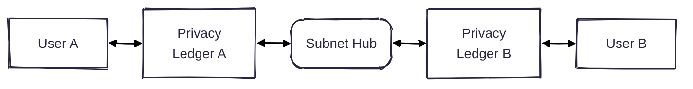

# Enygma
At Rayls, we have created a new suite of privacy protocols, which we call Enygma. Concretely, there are two variants of Enygma: Payments and Delivery-vs-Payment (DvP)

## System Architecture

## [Enygma Payments](./enygma_payments)

## [Enygma DvP](./enygma_dvp)
