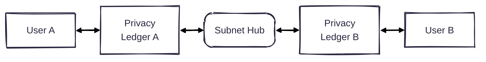

# Enygma
At Rayls, we have created a new suite of privacy protocols, which we call Enygma. 

Concretely, there are two variants of Enygma: 

* [Enygma Payments](./enygma_payments)
* [Enygma Delivery-vs-Payment (DvP)](./enygma_dvp)

## System Architecture

## Enygma Payments

## Enygma DvP
