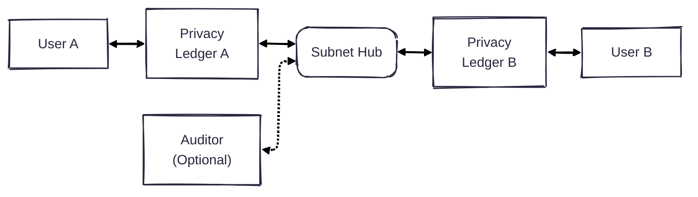

# Enygma
At Rayls, we have created a new suite of privacy protocols, which we call Enygma. 

Concretely, there are two variants of Enygma: 

* [Enygma Payments](./enygma_payments)
* [Enygma Delivery-vs-Payment (DvP)](./enygma_dvp)

## System Architecture

* **Users**: Traditional users of the system who want to transact with other users. 

* **Privacy Ledger(s)**:

* **Subnet Hub**:

* **Auditor** (optional): The auditor is an entity that oversees the transactions that take place in the system. This exists solely in case the system is deployed in a permissioned setting with the involvement of financial institutions. We note that the auditor only has a complete view of transactions that happen in the network iff the participants share the 'view' key with the auditor. We note that the auditor has no ability to spend funds on behalf of any system entity. 

### Adversarial Model
We assume that the Subnet Hub runs a Byzantine Fault Tolerant consensus and provides both safety and liveness. 

We assume an active network adversary with complete view of the network. Therefore, the adversary actively tries to infer which parties are transacting given the inboud/outbound messages in the system. 

We assume every privacy ledger runs a full node of the underlying blockchain (i.e., the subnet hub). As a result, privacy ledgers can always perform a simple Private Information Retrieval (PIR) protocol that downloads the latest block and performs the lookups locally. 

Additionally, if present, we assume that the auditor is honest/trusted. In other words, the auditor will ensure the privacy of all the key material and sensitive data. 

## Helpful Mental Model
If the reader is familiar with the Ethereum ecosystem, the easiest way to think about our approach is probably the following:

The subnet hub is an underlying L1. The privacy ledgers are (somewhat) equivalent to high-performance custom (validium) L2s. The balance (aka TVL) of each L2 is in the underlying L1 in a shielded manner to ensure the privacy of each institution. All the different shielded balances are recorded in a single L1 contract to ensure the liquidity is unified, as opposed to fragmented across different contracts. This approach ensures that entities can quickly transact with each other without very expensive operations on the underlying L1. 
