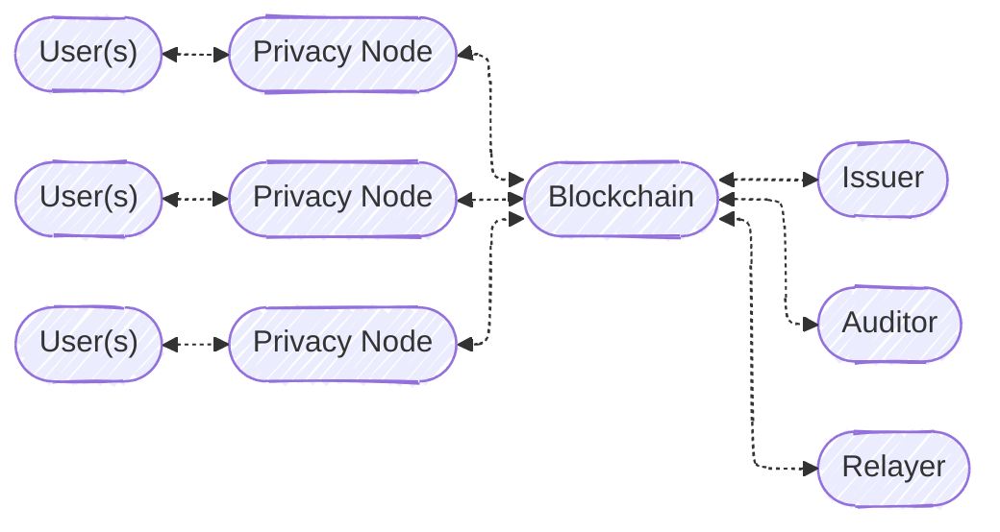
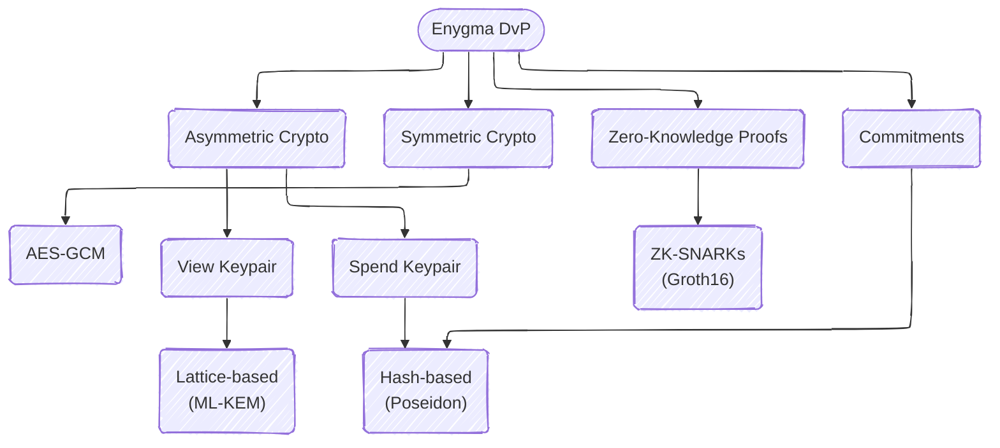

# Enygma Delivery-vs-Payment (DvP)

## Motivation

Enygma Dvp is privacy preserving Delivery-versus-Payment (DvP) protocol built on EVM compatible blockchains. It allows two parties to atomically swap private assets, such as ERC20, ERC721 and ERC1155. Without revealing amounts, identities or assets linkage on-chain.

## System Architecture

Our system is simple: **users** (e.g., a bank customers) are directly connected to **privacy nodes** (i.e., a high-performance single-node EVM blockchain). Each of the privacy nodes, is connected to a **private network hub**, which effectively acts as a bulletin board for all privacy nodes to leverage as a universal (encrypted) messaging layer and verification layer. **Issuer(s)** are the managers/admins of specific assets on the private network hub. Optionally, there is an **auditor** that oversees (some of) the transactions that take place in the network. A more formal protocol description is documented [here](./protocol_description.md).

An optional **relayer** is an authorized off-chain service that can submit both legs of a DvP swap atomically in a single transaction via
`SwapRelayer.sol`. When a relayer is present, Alice and Bob submit their proofs to the relayer off-chain; the relayer then calls `swapOnGroupPair` or `exchangeOnGroupPair` on-chain, collapsing the two-phase flow into one atomic settlement. Without a relayer, Alice and Bob interact with the contract directly via `submitPartialSettlement`.


```mermaid
---
config:
  theme: normal
  layout: elk
  look: handDrawn
---
flowchart LR
    UA(["User(s)"])
    UB(["User(s)"])
    UC(["User(s)"])

    PLA(["Privacy Node"])
    PLB(["Privacy Node"])
    PLC(["Privacy Node"])

    B(["Blockchain"])
    I(["Issuer"])
    A(["Auditor"])
    R(["Relayer"])

    PLA & PLB & PLC <-.-> B <-.-> I & A & R

    UA <-.-> PLA
    UB <-.-> PLB
    UC <-.-> PLC

```

## Protocol Overview

Two parities agree off-chain on the terms of the trade. Alice initiates the swap by submitting an on-chain transaction containing a zero-knowledge proof, an ML-KEM ciphertext addressed to Bob, and a set of output commitments. The blockchain locks Alice's nullifier and records a `swap_id`. Bob scans the chain, decrpyts the payload using his view key, verifies the commitments, generates his own proof, and submits it to finalize the swap. If Bob does not respond before the deadline, Alice and reclaim her funds via a pre-committed revert path.

The protocol accept two settlement paths

- Direct: Alice and Bob each call submitPartialSettlement independently.
- Relayer: Alice and Bob submit their proofs off-chain to a registered relayer.

For the full formal specification — key generation, commitment structure,
step-by-step cryptographic protocol, and security goals — see [here](./dvp_protocol.md)

## Cryptographic Primitives


```mermaid
---
config:
  theme: normal
  layout: elk
  look: handDrawn
---
flowchart TD
    A(["Enygma DvP"])

    Asymmetric("Asymmetric Crypto")
    Symmetric("Symmetric Crypto")
    ZK("Zero-Knowledge Proofs")
    Commits("Commitments")

    A -->  Asymmetric & Commits & Symmetric & ZK

    Symmetric --> aes("AES-GCM")

    Asymmetric --> View("View Keypair") & Spend("Spend Keypair")

    View --> MLKEM("Lattice-based<br>(ML-KEM)")
    Spend --> Hash("Hash-based<br>(Poseidon)")

    ZK --> snarks("ZK-SNARKs<br>(Groth16)")
    Commits --> Hash
```

Note: We intend to update the ZK module to use a quantum-secure ZK scheme, which will make the entire system quantum-secure (as opposed to quantum-private). We also intend to leverage the ability of having [Single-Server Private Outsourcing of zk-SNARKs
](https://eprint.iacr.org/2025/2113) to allow clients to submit ZK proofs to the Private Network Hub component of the system without incurring in unnecessary hardware costs.

## Repository Structure

```
enygma_dvp/
├── contracts/          Solidity smart contracts (Hardhat project)
├── artifacts/          Hardhat compilation outputs — DO NOT overwrite PoseidonT3/T5 (see Poseidon.sol)
├── build/              Deployment receipts (receipts.json) + gnark VK exports consumed by init.go
├── src/                Go core library (provers, crypto, Merkle tree, scan helpers)
├── gnark_circuits/     ZK proof server — REST API wrapping gnark Groth16 circuits
├── relayer/             Off-chain relayer service — collects proofs from both parties  and submits them to SwapRelayer.sol
├── scripts/            Go deployment and initialization scripts (deploy.go, init.go)
├── test/               Go integration tests (requires Hardhat node + gnark server)
├── docs/               Flow documentation and Mermaid diagrams
└── hardhat.config.js   Hardhat configuration (network, compiler settings)
```

### Go module layout

Four independent Go modules — no shared `go.work`, each must be built from its own directory.

| Directory         | Module name          | Depends on                                    |
| ----------------- | -------------------- | --------------------------------------------- |
| `src/`            | `enygma_dvp/src_go`  | external only                                 |
| `test/`           | `enygma_dvp/test`    | `enygma_dvp/src_go` (via `replace => ../src`) |
| `scripts/`        | `enygma_dvp`         | `enygma_dvp/src_go` (via `replace => ../src`) |
| `gnark_circuits/` | `gnark_server`       | external only (gnark, no dependency on src/)  |
| `relayer/`        | `enygma_dvp_relayer` | external only                                 |

### Running the System

Prerequisites

- Go 1.22+ (gnark_circuits/) and Go 1.24+ (src/, scripts/, test/)
- Node.js + npm (for Hardhat)

1. Start the gnark proof server

```bash
cd gnark_circuits
go run main.go # starts on :8081, keys loaded from ./scripts/keys/
```

2. Deploy contracts

```bash
# Start a local Hardhat node (in a separate terminal)
npx hardhat node

# Regenerate Poseidon artifacts (required after any npx hardhat compile)
node scripts/regen_poseidon.js

# Build and deploy
cd scripts && go build -o /tmp/deploy_contracts deploy.go enygma.go
cd .. && /tmp/deploy_contracts
# → saves contract addresses to build/receipts.json
```

3. Initialize on-chain state

```bash
# Export gnark VKs to build/
cd gnark_circuits && go run ./cmd/export_vk_init/ ../build

# Register VKs on-chain
cd scripts && go build -o /tmp/init_contracts init.go enygma.go
cd .. && /tmp/init_contracts
```

4. Running tests

```bash
#Unit tests(without server)
cd src && go test ./... -timeout 120s

# Integration tests (requires gnark server on :8081 + fresh Hardhat node)
cd test && go test ./... -v -timeout 600s
```

## Performance

To show that our protocol runs on commodity hardware and does not come with extreme hardware requirements, we measured the performance of our design using a Mac mini M1 from 2020 with 16GB of memory. We obtained the following numbers:

- \*\*Constraints:
  - Private Mint: 3116
  - DvPInitiator: 8704
  - DvpDestination: 8405
- **(Groth16) Prover time:**
  - Private Mint: ~18 ms
  - DvPInitiator: ~83 ms
  - DvpDestination: ~55 ms
- **(Groth16) Verifier cost:**
  - Private Mint: ~250.000 gas
  - DvPInitiator: ~290.000 gas
  - DvpDestination: ~272.000 gas
