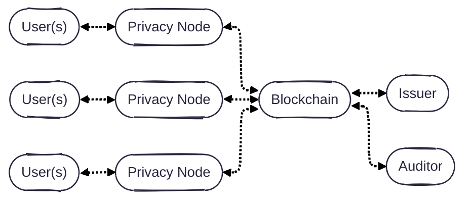
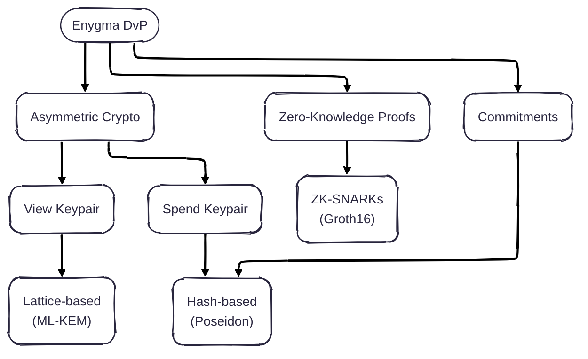

# Enygma Delivery-vs-Payment (DvP)

# Enygma Payments

## System Architecture
Our system is simple: **users** (e.g., a bank customers) are directly connected to **privacy nodes** (i.e., a high-performance single-node EVM blockchain). Each of the privacy nodes, is connected to a **private network hub**, which effectively acts as a bulletin board for all privacy nodes to leverage as a universal (encrypted) messaging layer and verification layer. **Issuer(s)** are the managers/admins of specific assets on the private network hub. Optionally, there is an **auditor** that oversees (some of) the transactions that take place in the network. A more formal protocol description is documented [here](./protocol_description.md).

## Cryptographic Primitives

Note: We intend to update the ZK module to use a quantum-secure ZK scheme, which will make the entire system quantum-secure (as opposed to quantum-private). We also intend to leverage the ability of having [Single-Server Private Outsourcing of zk-SNARKs
](https://eprint.iacr.org/2025/2113) to allow clients to submit ZK proofs to the Private Network Hub component of the system without incurring in unnecessary hardware costs. 

## Implementation Details
TBD

## Performance
To show that our protocol runs on commodity hardware and does not come with extreme hardware requirements, we measured the performance of our design using a Mac mini M1 from 2020 with 16GB of memory. We obtained the following numbers: 

* **Constraints:** TBD
* **(Groth16) Prover time:** TBD
* **(Groth16) Verifier cost:** TBD

## Peer-Reviewed Publications
TBD
