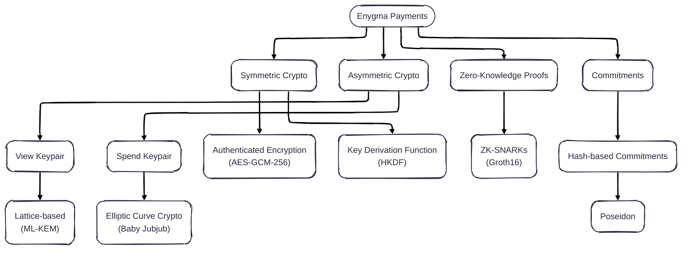

# Enygma Delivery-vs-Payment (DvP)

## Cryptographic Primitives

```mermaid
---
config:
  theme: redux
  layout: elk
  look: handDrawn
---
flowchart TD
    A(["Enygma Payments"])
    
    Symmetric("Symmetric Crypto")
    Asymmetric("Asymmetric Crypto")


    A --> Symmetric & Asymmetric & ZK("Zero-Knowledge Proofs") & Commits("Commitments")
    
    Asymmetric --> View("View Keypair") & Spend("Spend Keypair")

    Symmetric --> AES("Authenticated Encryption<br>(AES-GCM-256)") & HKDF("Key Derivation Function<br>(HKDF)")
    View --> MLKEM("Lattice-based<br>(ML-KEM)")
    Spend --> Babyjubjub("Elliptic Curve Crypto<br>(Baby Jubjub)")

    ZK --> snarks("ZK-SNARKs<br>(Groth16)")
    Commits --> hash_commits("Hash-based Commitments")
    hash_commits --> poseidon("Poseidon")
```

### Implementation Details
Circuits: Gnark
Verifier: Solidity

### Peer-Reviewed Publications
- TBC.
