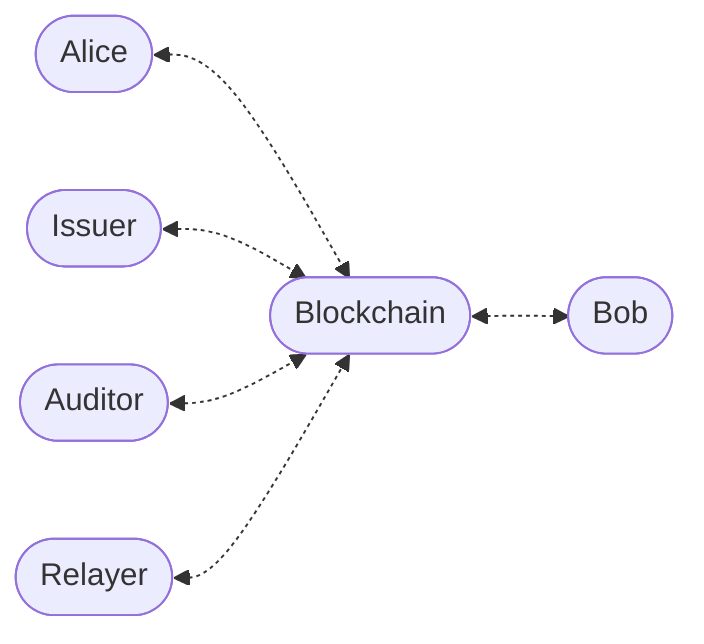

# Enygma DvP Private Swap Protocol

## System Entities

We assume a setting with three entities:

- Alice (the initiator)
- Blockchain (the verification and DvP coordination layer)
- Bob (the counterparty)
- Issuer (the administrator)
- Auditor (an authorized observer who can decrypt audit trails)
- Relayer (an authorized off-chain service that submits both proofs atomically)

### Adversarial Model

The adversary $$\mathcal{A}$$ aims to:

- break transactional privacy
- link inputs and outputs
- identify participants
- disrupt atomic settlement

We assume the blockchain correctly enforces the DvP smart contract logic and that the cryptographic primitives are secure.

---

## Key Generation

Each user generates:

- a **view keypair** using ML-KEM(post-quantum key encapsulation)
- a **spend keypair** using a hash-based construction (ZK-friendly)

$$
(pk^{\text{view}}, sk^{\text{view}}) \longleftarrow \mathrm{ML\text{-}KEM.KeyGen}()
$$

$$
sk^{\text{spend}} \longleftarrow {0,1}^{\lambda}, \qquad
pk^{\text{spend}} = \mathrm{H}(sk^{\text{spend}})
$$

where $\mathrm{H}$ is Poseidon (ZK-friendly hash).

**Key separation**: the spend key is used only inside ZK proofs;the view key is used only for key encapsulation.

---

## Registration

Each user publishes:

$$
(id, pk^{\text{view}}, pk^{\text{spend}})
$$

---

## Commitment Structure

Each note commitment has the following form:

$$
C= \mathrm{H}(pk^{\text{spend}}, salt, amount, token_{id})
$$

The owner can spend $Commitment$ by proving knowledge of $(sk^{\text{spend}}, salt, amount, token_{id})$ inside a ZK circuit and publishing the corresponding nullifier.

Each commitment is associated with exactly one leaf position in a Merkle sub-tree. The nullifier is:

$$
nf = \mathrm{H}(sk^{\text{spend}},\ leafIndex)
$$

where $leafIndex$ is the position of the commitment within its sub-tree.

The sub-tree index ($treeNum$) is a separate public input submitted alongside the proof. The on-chain contract uses it to route the nullifier check to the correct sub-tree map — but it is not mixed into the nullifier hash itself.

## Private Issuance

Before a user can participate in a DvP they need a private balance: a
commitment inserted into the on-chain Merkle tree that only they can spend.

Issuer steps:

1. Receives $(pk^{\text{spend}},\ amount,\ token_{id})$ from the recipient out-of-band.
2. Generates $salt \longleftarrow {0,1}^{\lambda}$.
3. Computes:

$$
C = \mathrm{H}(pk^{\text{spend}},\ salt,\ amount,\ token_{id})
$$

4. Generates a ZK proof $\pi$ (PrivateMint circuit) attesting:

- $C$ is well-formed for the given inputs
- $0 \le amount < 2^{128}$ (range check)
- a note tag $tag = \mathrm{H}(pk^{\text{spend}},\ salt,\ contractAddress)$
  binds the proof to this deployment

5. Submits $(\pi,\ C,\ tag,\ token_{id})$ to the smart contract, which
   verifies $\pi$ and inserts $C$ into the Merkle tree.
6. Delivers $salt$ privately to the recipient (out-of-band).

The recipient can now spend $C$ by proving knowledge of
$(sk^{\text{spend}},\ salt,\ amount,\ token_{id})$.

---

## DvP Overview

Alice and Bob agree on trade parameters:

- Alice sends $amount_{1}$ of $token_{id_{1}}$
- Bob sends $amount_{2}$ of $token_{id_{2}}$

We assume they each already hold input commitments:

$$
C^{\text{in}}A = \mathrm{H}(pk_A^{\text{spend}},\ salt_A^{\text{in}},\ amount_1,\ token{id_1})
$$

$$
C^{\text{in}}B = \mathrm{H}(pk_B^{\text{spend}},\ salt_B^{\text{in}},\ amount_2,\ token{id_2})
$$

The protocol enforces **atomic Delivery-versus-Payment (DvP)**:

- either both transfers occur
- or Alice recovers her funds through a revert commitment

---

## Transaction Structure (Alice → Blockchain)

| $\pi_{A}$ | CTXT | $C^{\text{out}}_B$ | $C^{\text{out}}_A$ | ENC_TX_DATA | $C^{\text{rev}}_A$ | $nf_{A}$ | deadline |
| :-------: | :--: | :----------------: | :----------------: | :---------: | :----------------: | :------: | :------: |

---

## Transaction Creation (Alice)

### Step 1 — ML-KEM Encapsulation

Alice encapsulates to Bob's view public key:

$$
(ss_{B}, \mathrm{CTXT}) \longleftarrow \mathrm{ML\text{-}KEM.Encaps}(pk_{B}^{\text{view}})
$$

---

### Step 2 — Key Derivation

Alice derives an encryption key:

$$
k = \mathrm{HKDF}(ss_{B}, \text{"encryption key"})
$$

Alice derives Bob's output salt:

$$
salt_{B}^{\text{out}} = \mathrm{HKDF}(ss_{B}, \text{"Bob salt"})
$$

Alice derives her own output salt:

$$
salt_{A}^{\text{out}} = \mathrm{HKDF}(ss_{B}, \text{"Alice salt"})
$$

Alice derives her own output salt for revert commitment:

$$
salt_A^{\text{rev}} \longleftarrow {0,1}^{\lambda}
$$

---

### Step 3 — Output Commitments

Bob's output commitment is:

$$
C^{\text{out}}B = \mathrm{H}(pk_B^{\text{spend}},\ salt_B^{\text{out}},\ amount_1,\ token{id_1})
$$

Alice's output commitment is:

$$
C^{\text{out}}A = \mathrm{H}(pk_A^{\text{spend}},\ salt_A^{\text{out}},\ amount_2,\ token{id_2})
$$

Revert commitment (Alice reclaims her asset if Bob times out):

$$

C^{\text{rev}}A = \mathrm{H}(pk_A^{\text{spend}},\ salt_A^{\text{rev}},\ amount_1,\ token{id_1})

$$

---

### Step 4 — Encrypt Transaction Data

Alice sets:

$$
m = token*{id*{1}} \parallel amount\_{1}
$$

and encrypts it as:

$$
\mathrm{[[TX_{ENC_TX_DATA}]]\_{k}} = \mathrm{AES\text{-}GCM.Enc}(k, m)

$$

This lets Bob verify what he will receive without Alice publishing plaintext on-chain.

---

### Step 5 — Nullifier

Let $leafIndex_A$ be Alice's leaf position in her sub-tree.

$$
nf_A = \mathrm{H}(sk_A^{\text{spend}},\ leafIndex_A)
$$

---

### Step 6 — Zero-Knowledge Proof (DvPInitiator circuit)

Alice generates $\pi_A$ proving (see §ZK Proof Statements for the full list).

---

Step 7 — Submission

$$
(\pi_A,\ \mathrm{CTXT},\ C^{\text{out}}_B,\ \mathrm{ENC_TX_DATA},\ C^{\text{out}}_A,\ C^{\text{rev}}_A,\ nf_A,\ treeNum_A,\ deadline)
$$

---

## Transaction Processing (Blockchain)

- the deadline is well-formed
- $block.timestamp \le deadline$
- $nf_A$ is not locked in sub-tree $treeNum_A$
- $nf_A$ is not spent in sub-tree $treeNum_A$
- $\mathrm{Verify}(\pi_A) = \mathrm{TRUE}$

If all checks pass:

$$
swap_{id} = \mathrm{H}(C^{\text{out}}_A,\ C^{\text{rev}}_A,\ nf_A,\ C^{\text{out}}_B,\ deadline)
$$

The blockchain:

- marks $nf_A$ as locked in sub-tree $treeNum_A$
- registers $swap_{id}$ as active with its deadline
- emits $(\mathrm{CTXT},\ C^{\text{out}}_B,\ \mathrm{ENC_TX_DATA},\ C^{\text{out}}A,\ swap{id})$

---

## Transaction Retrieval (Bob)

Bob receives: $\mathrm{CTXT},\ C^{\text{out}}_B,\ \mathrm{ENC_TX_DATA},\ C^{\text{out}}A,\ swap{id}$

---

### Step 1 — ML-KEM Decapsulation

Bob decapsulates:

$$

ss_B \leftarrow \mathrm{ML\text{-}KEM.Decaps} (sk_B^{\text{view}},\ \mathrm{CTXT})

$$

---

### Step 2 — Key and Salt Derivation

Bob derives the encryption key:

$$

k = \mathrm{HKDF}(ss_B,\ \text{"encryption key"})

$$

Bob derives his output salt and Alice's salt:

$$

\quad salt_B^{\text{out}} = \mathrm{HKDF}(ss_B,\ \text{"Bob salt"})

$$

Bob derives Alice's output salt:

$$

\quad salt_A^{\text{out}} = \mathrm{HKDF}(ss_B,\ \text{"Alice salt"})

$$

---

### Step 3 — Decryption

Bob decrypts:

$$

(token_{id_1},\ amount_1) = \mathrm{AES\text{-}GCM.Dec}(k,\ \mathrm{ENC_TX_DATA})

$$

If decryption fails, Bob aborts — the message was not addressed to him.

---

### Step 4 — Commitment Recompute

Bob recomputes his expected output commitment:

$$
\hat{C}B = \mathrm{H}(pk_B^{\text{spend}},\ salt_B^{\text{out}},\ amount_1,\ token{id_1}), \quad \hat{C}A = \mathrm{H}(pk_A^{\text{spend}},\ salt_A^{\text{out}},\ amount_2,\ token{id_2})
$$

Bob accepts if $\hat{C}_B = C^{\text{out}}_B$ and $\hat{C}_A = C^{\text{out}}_A$. Otherwise he aborts.

---

## Bob Completion

### Step 1 — Nullifier

Let $$leafIndex_{B}$$ be the Merkle-tree leaf index of Bob's input commitment.

Bob computes:

$$
nf_B = \mathrm{H}(sk_B^{\text{spend}},\ leafIndex_B)
$$

---

### Step 2 — Zero-Knowledge Proof

Bob generates $\pi_B$ proving (see §ZK Proof Statements for the full list).

---

### Step 3 — Submission

$$
(\pi_B,\ C^{\text{out}}A,\ nf_B,\ treeNum_B,\ swap{id})
$$

---

## Finalization (Blockchain)

### Success Case

$$
(block.timestamp < deadline) ;\wedge; (\mathrm{Verify}(\pi_B) = \mathrm{TRUE}) ;\wedge; (nf_B\ \text{fresh in}\ treeNum_B) ;\wedge; (swap_{id}\ \text{active})
$$

The blockchain:

- marks $nf_A$ as spent in sub-tree $treeNum_A$
- marks $nf_B$ as spent in sub-tree $treeNum_B$
- inserts $C^{\text{out}}_A$ into the Merkle tree — Alice receives Bob's asset
- inserts $C^{\text{out}}_B$ into the Merkle tree — Bob receives Alice's asset
- marks $swap_{id}$ as completed

---

### Timeout / Failure Case

If Bob does not complete before the deadline, Alice triggers the revert path. The blockchain checks: $swap_{id}$ active, $block.timestamp \ge deadline$, $nf_A$ locked and not spent in sub-tree $treeNum_A$.

If valid:

- marks $nf_A$ as spent in sub-tree $treeNum_A$
- inserts $C^{\text{rev}}_A$ into the Merkle tree — Alice reclaims her asset
- marks $swap_{id}$ as failed

---

## Relayer Path (Optional)

When a relayer is registered, Alice and Bob submit their proofs off-chain to the relayer instead of directly to the blockchain. The relayer calls $\mathrm{SwapRelayer.swapOnGroupPair}()$, submitting both proofs atomically in a single transaction:

$$
\text{Relayer} \xrightarrow{;\pi_A,;\pi_B,;\text{all associated data};} \text{Blockchain}
$$

This collapses the two-phase flow into one atomic settlement. The relayer is authorized at deployment time and cannot forge proofs — it acts purely as a batching transport.

## Security Goals

- **Atomicity**: either both sides settle or Alice recovers her original asset
- **Privacy**: commitments hide owners, amounts, token identifiers, and linkage
- **Fairness**: Bob cannot receive Alice's asset unless he spends his own input
- **Replay resistance**: nullifiers prevent double-spending
- **Timeout safety**: locked funds can be recovered after the deadline
- **Bounded griefing**: Bob can delay settlement only until the deadline

---

## Zero-Knowledge Proof Remarks

### Alice Proof: $\pi_{A}$

Alice's proof must enforce:

- $pk_A^{\text{spend}} = \mathrm{H}(sk_A^{\text{spend}})$
- $C^{\text{in}}A = \mathrm{H}(pk_A^{\text{spend}},\ salt_A^{\text{in}},\ amount_1,\ token{id_1})$
- $C^{\text{in}}_A$ is at $leafIndex_A$ in the Merkle tree with root $MerkleRoot_A$
- $nf_A = \mathrm{H}(sk_A^{\text{spend}},\ leafIndex_A)$
- $C^{\text{out}}B = \mathrm{H}(pk_B^{\text{spend}},\ salt_B^{\text{out}},\ amount_1,\ token{id_1})$
- $C^{\text{out}}A = \mathrm{H}(pk_A^{\text{spend}},\ salt_A^{\text{out}},\ amount_2,\ token{id_2})$
- $C^{\text{rev}}A = \mathrm{H}(pk_A^{\text{spend}},\ salt_A^{\text{rev}},\ amount_1,\ token{id_1})$
- $\mathrm{StMessage} = C^{\text{out}}_A$
- $0 \le amount_1,\ amount_2 < 2^{128}$

---

### Bob Proof: $\pi_{B}$

#### Alice's Proof $\pi_A$ — DvPInitiator Circuit

Public inputs: $(\mathrm{StMessage},\ treeNum_A,\ MerkleRoot_A,\ nf_A,\ C^{\text{out}}_B,\ C^{\text{out}}_A,\ C^{\text{rev}}_A)$

The circuit enforces:

- $pk_A^{\text{spend}} = \mathrm{H}(sk_A^{\text{spend}})$
- $C^{\text{in}}A = \mathrm{H}(pk_A^{\text{spend}},\ salt_A^{\text{in}},\ amount_1,\ token{id_1})$
- $C^{\text{in}}_A$ is at $leafIndex_A$ in the Merkle tree with root $MerkleRoot_A$
- $nf_A = \mathrm{H}(sk_A^{\text{spend}},\ leafIndex_A)$
- $C^{\text{out}}B = \mathrm{H}(pk_B^{\text{spend}},\ salt_B^{\text{out}},\ amount_1,\ token{id_1})$
- $C^{\text{out}}A = \mathrm{H}(pk_A^{\text{spend}},\ salt_A^{\text{out}},\ amount_2,\ token{id_2})$
- $C^{\text{rev}}A = \mathrm{H}(pk_A^{\text{spend}},\ salt_A^{\text{rev}},\ amount_1,\ token{id_1})$
- $\mathrm{StMessage} = C^{\text{out}}_A$
- $0 \le amount_1,\ amount_2 < 2^{128}$

Note: $treeNum_A$ is used by the contract for nullifier map routing; it is not incorporated into the nullifier computation.

#### Bob's Proof $\pi_B$ — DvPDestination Circuit

Public inputs: $(\mathrm{StMessage},\ treeNum_B,\ MerkleRoot_B,\ nf_B,\ C^{\text{out}}_A)$

The circuit enforces:

- $pk_B^{\text{spend}} = \mathrm{H}(sk_B^{\text{spend}})$
- $C^{\text{in}}B = \mathrm{H}(pk_B^{\text{spend}},\ salt_B^{\text{in}},\ amount_2,\ token{id_2})$
- $C^{\text{in}}_B$ is at $leafIndex_B$ in the Merkle tree with root $MerkleRoot_B$
- $nf_B = \mathrm{H}(sk_B^{\text{spend}},\ leafIndex_B)$
- $C^{\text{out}}A = \mathrm{H}(pk_A^{\text{spend}},\ salt_A^{\text{out}},\ amount_2,\ token{id_2})$
- $C^{\text{out}}B = \mathrm{H}(pk_B^{\text{spend}},\ salt_B^{\text{out}},\ amount_1,\ token{id_1})$
- $\mathrm{StMessage} = C^{\text{out}}_B$
- $0 \le amount_2,\ amount_1 < 2^{128}$

Note: $treeNum_B$ is used by the contract for nullifier map routing; it is not incorporated into the nullifier computation.

---

## Notes

- View keys are **ML-KEM keys**, not Diffie-Hellman keys.
- The DvP smart contract never learns the private salts.
- Bob verifies Alice's encrypted payload by AEAD authentication and commitment recomputation.
- Alice's input nullifier is first marked as locked, then later marked as spent.
- Bob's input nullifier is marked as spent only in the successful settlement path.
- The revert path consumes Alice's locked input and inserts $$\mathrm{REVERT_COMMIT}_{A}$$.
- Encryption correctness is not directly proven inside the zero-knowledge proof.
- Recipient-side validation is performed by decapsulation, decryption, and commitment recomputation.
  $$
