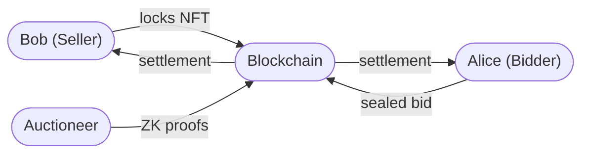
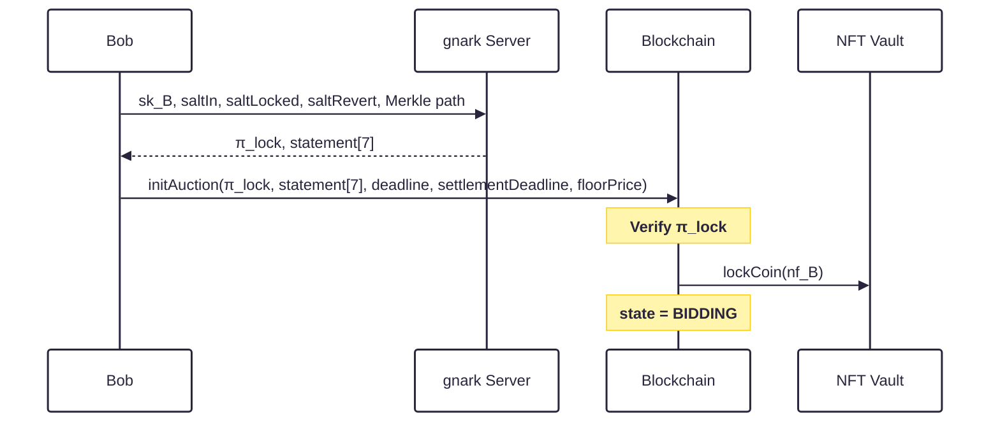
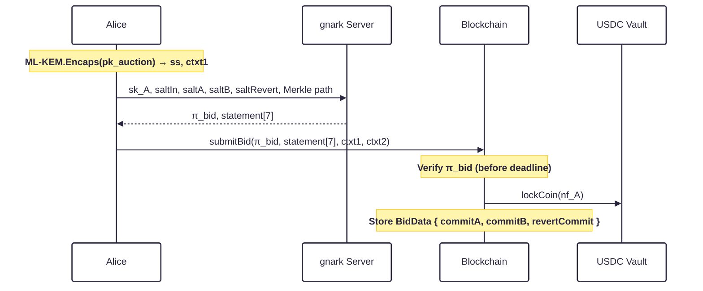
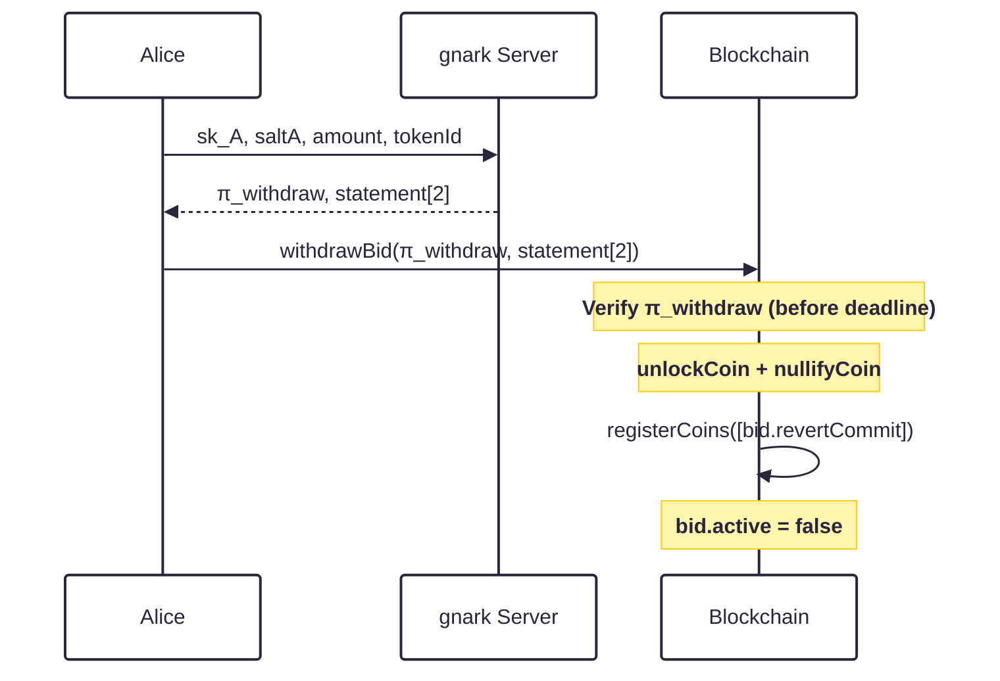
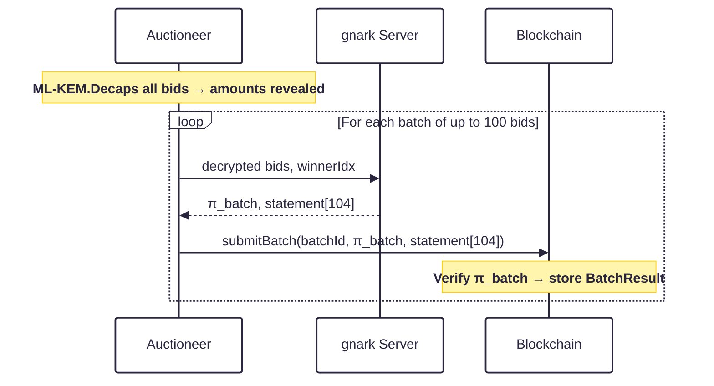
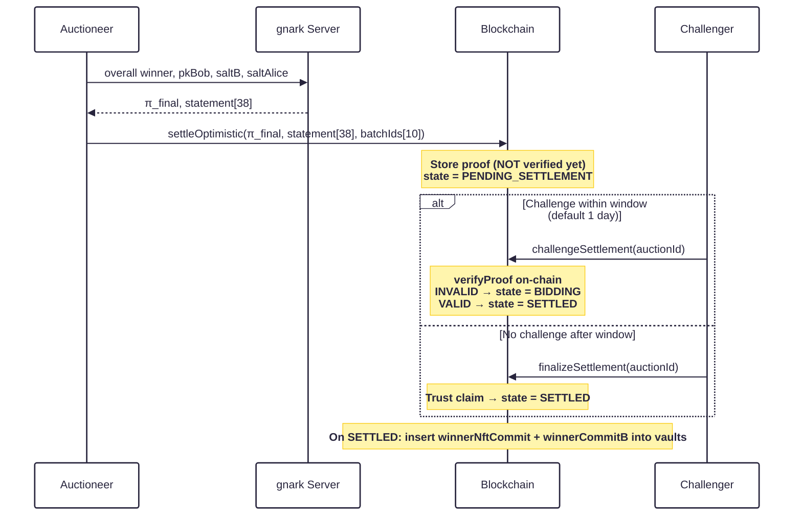
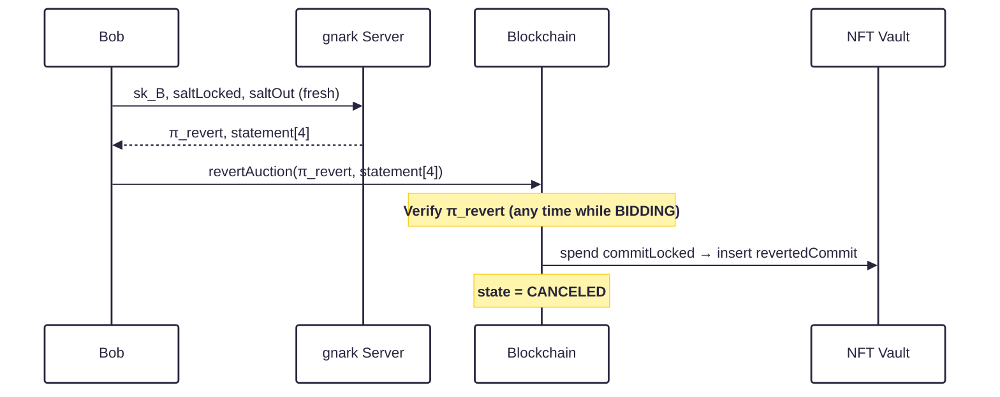
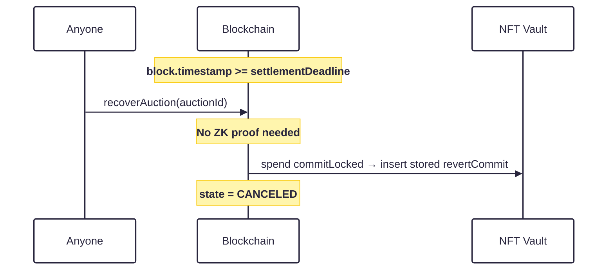
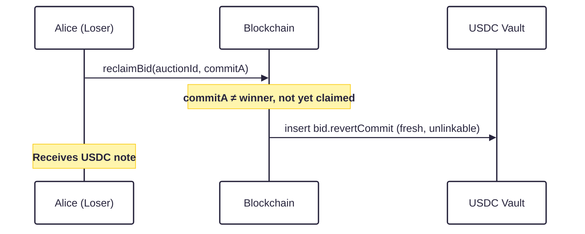
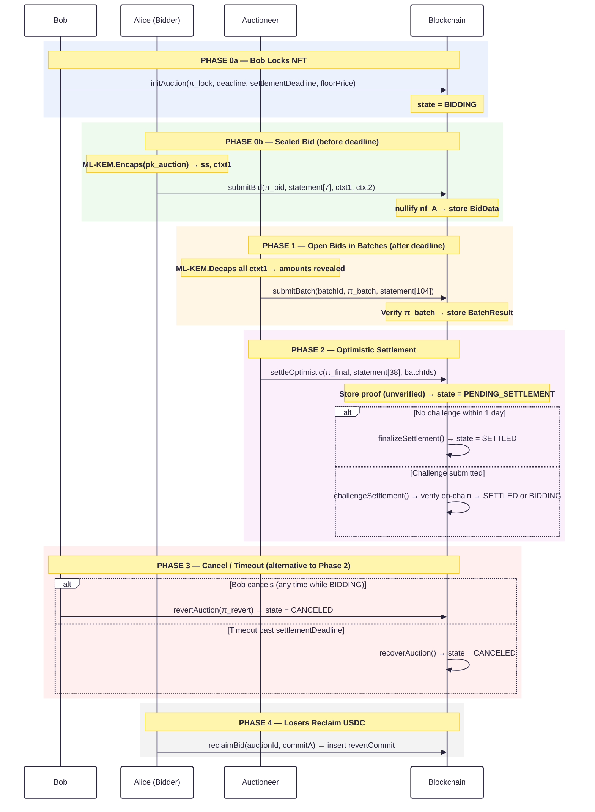

# Enygma Auction Protocol

## System Entities

We assume a setting with four distinct roles:

- **Bob** — the NFT seller who opens the auction
- **Alice** — a bidder who wishes to acquire the NFT
- **Auctioneer** — an off-chain service that processes bids and generates settlement proofs
- **Blockchain** — the on-chain verification and settlement layer

---

## Key Generation

Each participant generates two key pairs: a **view key pair** (ML-KEM) and a **spend key pair** (hash-based).

$$
(pk^{\text{view}}, sk^{\text{view}}) \longleftarrow \mathrm{ML\text{-}KEM.KeyGen}()
$$

$$
sk^{\text{spend}} \longleftarrow \{0,1\}^{\lambda}
$$

$$
pk^{\text{spend}} = \mathrm{H}(sk^{\text{spend}})
$$

The auctioneer additionally generates a dedicated ML-KEM keypair $(pk^{\text{auction}}, sk^{\text{auction}})$, which is published on-chain. Bidders encapsulate to this key so that only the auctioneer can open sealed bids.

---

## Note Commitments

Every private asset holding is represented by a **note commitment**. The preimage stays with the owner; only the commitment is published on-chain.

### ERC-20 (fungible, e.g. USDC)

$$
C = \mathrm{H}(pk^{\text{spend}},\; salt,\; amount,\; token\_id)
$$

### ERC-721 (non-fungible)

$$
C = \mathrm{H}(pk^{\text{spend}},\; salt,\; 1,\; token\_id)
$$

The amount field is fixed to 1 for non-fungible tokens, making the ERC-721 commitment a special case of the ERC-20 formula.

### Nullifier

To spend a note, the owner publishes a nullifier that permanently invalidates it:

$$
nf = \mathrm{H}(sk^{\text{spend}},\; leafIndex)
$$

The contract rejects any nullifier already seen, preventing double-spends. The spend secret key is never revealed.

### Auction ID

The auction's unique on-chain identifier is derived from the locked NFT commitment:

$$
auctionId = \mathrm{H}(commitLocked)
$$

This binds the auction ID to the specific NFT lock — no two auctions over different NFTs can share the same ID.

---

## Protocol Overview

The protocol proceeds in four phases:

| Phase  | Who acts     | What happens                                          |
| ------ | ------------ | ----------------------------------------------------- |
| **0a** | Bob          | Locks NFT, opens bidding                              |
| **0b** | Alice (× N)  | Submits sealed USDC bid (USDC note locked, not spent) |
| **0c** | Alice        | Optionally withdraws bid before deadline (ZK proof)   |
| **1**  | Auctioneer   | Opens bids in batches of 100, proves correctness      |
| **2**  | Auctioneer   | Proves overall winner, settles optimistically         |
| **3**  | Bob / Anyone | Cancels or triggers timeout recovery                  |
| **4**  | Losers       | Reclaim USDC via pre-committed revert notes           |

---

## Phase 0a — Bob Locks the NFT (`initAuction`)

Bob owns an NFT note already in the vault:

$$
commitIn = \mathrm{H}(pk_B^{\text{spend}},\; saltIn,\; 1,\; tokenId)
$$

Bob prepares the auction by generating:

$$
saltLocked \longleftarrow \{0,1\}^{\lambda} \qquad \text{(fresh random)}
$$

$$
saltRevert \longleftarrow \{0,1\}^{\lambda} \qquad \text{(fresh random, } \neq saltLocked\text{)}
$$

$$
commitLocked = \mathrm{H}(pk_B^{\text{spend}},\; saltLocked,\; 1,\; tokenId)
$$

$$
revertCommit = \mathrm{H}(pk_B^{\text{spend}},\; saltRevert,\; 1,\; tokenId)
$$

$$
auctionId = \mathrm{H}(commitLocked)
$$

$$
nf_B = \mathrm{H}(sk_B^{\text{spend}},\; leafIndex_B)
$$

Bob also sets the auction parameters:

- $deadline$ — Unix timestamp after which bidding closes
- $settlementDeadline$ — Unix timestamp after which anyone can trigger timeout recovery ($> deadline$)
- $floorPrice$ — the minimum acceptable winning amount (enforced inside the ZK circuit)

Bob generates a zero-knowledge proof $\pi_{lock}$ attesting that:

- He knows the spend key for the NFT note being spent
- The nullifier $nf_B$ is well-formed
- $commitLocked$ is formed from the same owner and $tokenId$ as the input note
- $auctionId = \mathrm{H}(commitLocked)$ is correctly derived
- $revertCommit$ is formed from the same owner and $tokenId$ with a fresh salt $\neq saltLocked$
- The input note exists in the on-chain Merkle tree (Merkle path proof)

Bob submits the following payload:

| $\pi_{lock}$ | $auctionId$ | $nf_B$ | $commitLocked$ | $tokenId$ | $revertCommit$ | $deadline$ | $settlementDeadline$ | $floorPrice$ |
| :----------: | :---------: | :----: | :------------: | :-------: | :------------: | :--------: | :------------------: | :----------: |

Upon success, the contract records $commitLocked$ and $revertCommit$ for this auction. The $revertCommit$ is stored for use by the timeout recovery path — it requires no further input from Bob.

---

## Phase 0b — Alice Submits a Sealed Bid (`submitBid`)

Alice owns a USDC note:

$$
commitIn = \mathrm{H}(pk_A^{\text{spend}},\; saltIn,\; amount,\; tokenId)
$$

### Step 1 — ML-KEM Encapsulation (Sealed Bid)

Alice encapsulates to the auctioneer's public key so that the bid amount remains hidden from everyone (including the auctioneer) until after the deadline:

$$
(ctxt_1,\; ss) \longleftarrow \mathrm{ML\text{-}KEM.Encaps}(pk^{\text{auction}})
$$

### Step 2 — Key and Salt Derivation

$$
saltA = \mathrm{HKDF}(ss,\; \text{"bid salt A"}) \quad \text{(Alice's locked bid salt)}
$$

$$
saltB = \mathrm{HKDF}(ss,\; \text{"note salt"}) \quad \text{(Bob's payout note salt)}
$$

$$
k = \mathrm{HKDF}(ss,\; \text{"bid key"}) \quad \text{(symmetric key for bid payload)}
$$

$$
saltRevert \longleftarrow \{0,1\}^{\lambda} \quad \text{(fresh random, } \neq saltA\text{)}
$$

### Step 3 — Output Commitments

Alice computes two output commitments:

$$
commitA = \mathrm{H}(pk_A^{\text{spend}},\; saltA,\; amount,\; tokenId)
$$

Alice's locked bid — held in escrow. Released back to Alice if she loses; Alice proves she owns it.

$$
commitB = \mathrm{H}(pk_B^{\text{spend}},\; saltB,\; amount,\; tokenId)
$$

Bob's USDC payout note — only spendable by Bob after the auction settles in his favour.

$$
revertCommit = \mathrm{H}(pk_A^{\text{spend}},\; saltRevert,\; amount,\; tokenId)
$$

Alice's pre-committed recovery note — inserted into the tree if she loses, under a fresh salt that cannot be linked to $commitA$.

### Step 4 — Encrypt Bid Details

$$
ctxt_2 = \mathrm{AEAD.Enc}(k,\; pk_B^{\text{spend}} \parallel tokenId \parallel amount,\; \text{aad} = ctxt_1)
$$

$ctxt_2$ allows the auctioneer to verify the preimage of $commitB$ and recover the winning amount.

### Step 5 — Nullifier

$$
nf_A = \mathrm{H}(sk_A^{\text{spend}},\; leafIndex_A)
$$

### Step 6 — Zero-Knowledge Proof

Alice generates $\pi_{bid}$ attesting that:

- She knows the spend key for the USDC note being spent
- The nullifier $nf_A$ is well-formed
- $commitA$ is formed from her own key, with the same $amount$ and $tokenId$ as the input note
- $commitB$ is formed using $pk_B^{\text{spend}}$ and $saltB$ (derived from ML-KEM)
- The bid is **all-in**: $amount_{bid} = amount_{in}$ (no change output)
- $0 < amount_{bid} < 2^{128}$ (range check prevents zero bids and overflow)
- $revertCommit$ is formed from her own key with the same amount and a fresh $saltRevert \neq saltA$
- The input note exists in the on-chain Merkle tree

Alice submits the following payload:

| $\pi_{bid}$ | $auctionId$ | $nf_A$ | $commitA$ | $commitB$ | $revertCommit$ | $ctxt_1$ | $ctxt_2$ |
| :---------: | :---------: | :----: | :-------: | :-------: | :------------: | :------: | :------: |

The bidder's USDC note is **locked** (not permanently spent) at `submitBid` time. It is permanently spent (unlock + nullify) only later — at withdrawal, reclaim, or settlement. This enables bid withdrawal before the deadline.

The ML-KEM capsule $ctxt_1$ and encrypted payload $ctxt_2$ are stored in the event log. The auctioneer monitors these events and decrypts all bids after the deadline.

---

## Phase 0c — Alice Withdraws a Bid (`withdrawBid`)

A bidder may withdraw their sealed bid at any time while the auction is in `BIDDING` state **and** before $deadline$. After $deadline$ the auctioneer has already begun decrypting bids, and allowing withdrawal at that point would let bidders selectively retract after observing partial batch results — so withdrawal is deadline-gated.

### Phase-0c ZK Proof

Alice generates $\pi_{withdraw}$ attesting that:

- She knows the spend key $sk_A$ for the bid, i.e.

$$
pk_A = \mathrm{H}(sk_A)
$$

- The preimage of $commitA$ is known:

$$
\mathrm{H}(pk_A,\; saltA,\; amount,\; tokenId) = commitA
$$

This proves the caller is the original bidder who chose $saltA$ at `submitBid` time. No Merkle proof is needed — the USDC note is already locked in the vault; ownership is established by the preimage alone.

The withdraw statement has 2 public elements:

$$
[auctionId,\; commitA]
$$

The contract looks up the stored `BidData` by `commitA`, verifies the proof, then:

1. Permanently spends the locked USDC note ($\mathrm{unlockCoin} + \mathrm{nullifyCoin}$)
2. Inserts $revertCommit$ (pre-committed at `submitBid` time, proven unlinkable) into the USDC tree
3. Sets `bid.active = false` — the auctioneer's `submitBatch` cross-check will reject this `commitA`

Alice submits:

| $\pi_{withdraw}$ | $auctionId$ | $commitA$ |
| :--------------: | :---------: | :-------: |

---

## Phase 1 — Auctioneer Opens Bids in Batches (`submitBatch`)

### Auctioneer Decrypts All Bids

After $deadline$, the auctioneer reads every `BidSubmitted` event and decrypts each bid:

$$
ss_i = \mathrm{ML\text{-}KEM.Decaps}(sk^{\text{auction}},\; ctxt_{1,i})
$$

$$
(pk_{B,i},\; tokenId_i,\; amount_i) = \mathrm{AEAD.Dec}(\mathrm{HKDF}(ss_i, \text{"bid key"}),\; ctxt_{2,i})
$$

$$
saltA_i = \mathrm{HKDF}(ss_i,\; \text{"bid salt A"})
$$

Bids are grouped into batches of up to 100. For each batch the auctioneer identifies the batch winner:

$$
i^* = \arg\max_i(amount_i)
$$

### Phase-1 ZK Proof

The auctioneer generates $\pi_{batch}$ attesting that:

- For every **active slot** $i$: the preimage of $commitA_i$ is known, i.e.

$$
\mathrm{H}(pk_{A,i},\; saltA_i,\; amount_i,\; tokenId_i) = commitA_i
$$

This proves the auctioneer honestly ML-KEM-decrypted each bid rather than fabricating bid data.

- The declared batch winner amount $\geq$ every active slot amount (winner dominance — no higher bid was hidden)
- The winning slot fields $(commitA_{i^*},\; pk_{A,i^*},\; amount_{i^*})$ match the declared batch winner outputs exactly
- The winning slot is active and has a strictly positive amount

The batch statement has 104 public elements:

$$
[auctionId,\; commitA_0, \ldots, commitA_{99},\; batchWinnerCommit,\; batchWinnerPk,\; batchWinnerAmount]
$$

### Batch Submission Flow

The contract additionally cross-checks every non-zero $commitA$ in the statement against bids registered via `submitBid`, preventing the auctioneer from including phantom bids that were never submitted on-chain.

The maximum supported capacity is **10 batches × 100 bids = 1,000 bids per auction**.

---

## Phase 2 — Settlement (`settleOptimistic`)

### Auctioneer Selects the Overall Winner

$$
j^* = \arg\max_{j}(batchWinnerAmount_j)
$$

The overall winner is the highest bidder across all batches. The auctioneer already has the winning bid's shared secret $ss_{j^*}$ from Phase 1, so they recover:

$$
saltB_{j^*} = \mathrm{HKDF}(ss_{j^*},\; \text{"note salt"})
$$

The auctioneer computes the settlement output commitments:

$$
winnerCommitB = \mathrm{H}(pk_B^{\text{spend}},\; saltB_{j^*},\; amount_{j^*},\; usdcTokenId)
\quad \text{(Bob's USDC payout)}
$$

$$
saltAlice \longleftarrow \{0,1\}^{\lambda}
$$

$$
winnerNftCommit = \mathrm{H}(pk_{A,j^*}^{\text{spend}},\; saltAlice,\; 1,\; nftTokenId)
\quad \text{(winner's new NFT note)}
$$

### Phase-2 ZK Proof

The auctioneer generates $\pi_{final}$ attesting that:

- The overall winner has the highest amount across all active batches (winner dominance over 10 batch slots)
- $winnerCommitB$ is correctly formed from $pk_B^{\text{spend}}$ and $saltB$ recovered via ML-KEM decryption — proving the auctioneer honestly read the winning bid
- $winnerNftCommit$ uses $pk_{A,j^*}^{\text{spend}}$ (public from Phase-1 proof) — the auctioneer cannot redirect the NFT to an arbitrary key
- $amount_{j^*} \geq floorPrice$ — the floor price is **enforced inside the circuit**; a sub-floor settlement proof is mathematically impossible
- $amount_{j^*} > 0$

The final statement has 38 public elements:

$$
[auctionId,\; batchWinnerCommit_{0..9},\; batchWinnerPk_{0..9},\; batchWinnerAmount_{0..9},
$$

$$
overallWinnerCommit,\; winnerPk,\; winnerCommitB,\; winnerNftCommit,\; nftTokenId,\; winningAmount,\; floorPrice]
$$

### Optimistic Settlement Flow

The auctioneer submits the settlement claim **without on-chain proof verification**. The contract cross-checks the batch slot values (already verified in Phase 1) and stores the proof. Verification is deferred to the challenge window.

The optimistic path means **the honest case costs no on-chain proof verification** (saved gas). A fraudulent claim is always catchable within the challenge window since Groth16 verification is deterministic.

---

## Phase 3a — Bob Cancels the Auction (`revertAuction`)

Bob may cancel **at any time while the auction is in BIDDING state** — before or after the bidding deadline. Because bids are sealed with ML-KEM, Bob gains no information advantage from early cancellation.

Bob generates:

$$
saltOut \longleftarrow \{0,1\}^{\lambda} \quad (\neq saltLocked)
$$

$$
revertedCommit = \mathrm{H}(pk_B^{\text{spend}},\; saltOut,\; 1,\; tokenId)
$$

Bob generates $\pi_{revert}$ attesting that:

- He knows $saltLocked$ such that $\mathrm{H}(pk_B^{\text{spend}}, saltLocked, 1, tokenId) = commitLocked$ — proving he is the genuine seller
- $revertedCommit$ uses a fresh $saltOut \neq saltLocked$ — preventing linkability to the public locked commitment
- $auctionId = \mathrm{H}(commitLocked)$ and $tokenId$ are consistent

No Merkle proof is needed because $commitLocked$ was never inserted into the vault tree — ownership is proven via knowledge of the preimage.

---

## Phase 3b — Timeout Recovery (`recoverAuction`)

If the auctioneer fails to settle before $settlementDeadline$, **anyone** can trigger recovery with no ZK proof:

The $revertCommit$ was proven well-formed and unlinkable from $commitLocked$ at `initAuction` time by the AuctionLock circuit. No further ZK proof is required at recovery time, ensuring Bob's NFT can always be returned even if he is offline.

---

## Phase 4 — Losers Reclaim USDC (`reclaimBid`)

After the auction is SETTLED or CANCELED, every losing bidder can reclaim their locked USDC. No ZK proof is required — the contract checks:

1. Auction state is SETTLED or CANCELED
2. $commitA$ was registered via `submitBid`
3. $commitA \neq overallWinnerCommit$ (the winner cannot reclaim)
4. The bid has not already been claimed

On success, the pre-committed $revertCommit$ (stored at `submitBid` time) is inserted into the USDC tree:

$$
\text{erc20Vault.registerCoins}([\; bid.revertCommit \;])
$$

Because $saltRevert \neq saltA$ was enforced in-circuit by AuctionBid, the returned note is cryptographically unlinkable from the public $commitA$. An observer cannot tell whether a new USDC leaf came from a losing bid, a normal deposit, or any other operation.

---

## Full Protocol

---

## Privacy Properties

### What is hidden

| Value                            | From whom                 | Mechanism                                                            |
| -------------------------------- | ------------------------- | -------------------------------------------------------------------- |
| Bid amounts                      | Everyone until Phase 1    | ML-KEM encryption — only the auctioneer can decapsulate              |
| Individual losing amounts        | Everyone permanently      | ZK circuit proves winner correctness without revealing other amounts |
| Bidder identity ($pk_A$, $sk_A$) | Everyone on-chain         | Only $commitA$ and $nf_A$ appear on-chain                            |
| Bob's spend key                  | Everyone                  | Only $commitLocked$ and $revertCommit$ appear on-chain               |
| Winning bid amount               | Everyone until settlement | Hidden until $winningAmount$ is published in settlement statement    |

### What is revealed

| Value                                | When revealed    | Where                                                                   |
| ------------------------------------ | ---------------- | ----------------------------------------------------------------------- |
| $tokenId$                            | At `initAuction` | `AuctionInitialized` event — bidders must know what they are bidding on |
| $commitA$, $commitB$, $revertCommit$ | At `submitBid`   | `BidSubmitted` event                                                    |
| $ctxt_1$, $ctxt_2$ (ML-KEM capsule)  | At `submitBid`   | `BidSubmitted` event                                                    |
| Batch winner amount                  | At `submitBatch` | `BatchProcessed` event — minimum amount revealed by the protocol        |
| Overall winner commit and amount     | At settlement    | `AuctionSettled` event                                                  |

### Unlinkability of reclaimed notes

Both $revertAuction$ and $reclaimBid$ insert commitments with fresh salts proven by ZK circuits to differ from the public locked salts. A chain observer cannot distinguish a recovered NFT note or reclaimed USDC note from any ordinary deposit.

---

## Security Properties

### Only Bob can cancel (`revertAuction`)

The AuctionRevert circuit requires knowledge of $saltLocked$ — the preimage of $commitLocked$. This value is never published; only the commitment appears on-chain.

### Auctioneer cannot manipulate winners

- **Phase 1**: The AuctionBatch circuit proves the auctioneer knows the preimage of every active $commitA$ (i.e., successful decryption), and that the declared winner has the maximum amount.
- **Phase 2**: The AuctionFinal circuit proves the overall winner is the maximum across all batches. The winner's NFT note is bound to $pk_{winner}$, which is public from the Phase-1 statement — the auctioneer cannot redirect the NFT.
- **Phase 2 ($commitB$)**: The circuit proves $winnerCommitB$ uses $pk_B^{\text{spend}}$ and $saltB$ from the winning bid's ML-KEM decryption — the auctioneer cannot redirect the USDC payment.

### Floor price is circuit-enforced

The AuctionFinal circuit enforces:

$$
amount_{j^*} \geq floorPrice
$$

A sub-floor settlement proof is mathematically impossible to construct. The contract additionally cross-checks $StFloorPrice = a.floorPrice$ at settlement time.

### Optimistic settlement: fraudulent claims are catchable

`settleOptimistic` stores the proof but does not verify it on-chain. Anyone can force real verification within the challenge window by calling `challengeSettlement`. Groth16 verification is deterministic: an invalid proof always fails. A fraudulent settlement therefore cannot be finalized if at least one honest challenger exists.

### Liveness under auctioneer failure

If the auctioneer goes offline, Bob can call `revertAuction` at any time (while BIDDING), or anyone can call `recoverAuction` after $settlementDeadline$. The latter requires no ZK proof and no participation from Bob — the $revertCommit$ was pre-committed at auction open time.

---

## Zero-Knowledge Proof Clauses Summary

### $\pi_{lock}$ (AuctionLock — 7 public signals)

- I know the spend key for the NFT note being spent
- The nullifier $nf_B = \mathrm{H}(sk_B, leafIndex_B)$ is well-formed
- $commitLocked = \mathrm{H}(pk_B, saltLocked, 1, tokenId)$ is correctly formed
- $auctionId = \mathrm{H}(commitLocked)$
- $revertCommit = \mathrm{H}(pk_B, saltRevert, 1, tokenId)$ with $saltRevert \neq saltLocked$
- The input NFT note exists in the on-chain Merkle tree

### $\pi_{bid}$ (AuctionBid — 7 public signals)

- I know the spend key for the USDC note being spent
- The nullifier $nf_A = \mathrm{H}(sk_A, leafIndex_A)$ is well-formed
- $commitA = \mathrm{H}(pk_A, saltA, amount, tokenId)$ is correctly formed (all-in: $bidAmount = amount_{in}$)
- $commitB = \mathrm{H}(pk_B, saltB, amount, tokenId)$ is correctly formed with ML-KEM-derived $saltB$
- $revertCommit = \mathrm{H}(pk_A, saltRevert, amount, tokenId)$ with $saltRevert \neq saltA$
- $0 < amount \leq 2^{128}$ (range check)
- The input USDC note exists in the on-chain Merkle tree

### $\pi_{batch}$ (AuctionBatch — 104 public signals)

- For every active slot, I know the preimage of its $commitA$ (ML-KEM decryption is honest)
- The declared batch winner amount $\geq$ all active slot amounts
- The declared batch winner commit, pk, and amount match the selected slot exactly
- The winning slot is active and has a strictly positive amount

### $\pi_{final}$ (AuctionFinal — 38 public signals)

- The declared overall winner amount $\geq$ all active batch winner amounts
- $winnerCommitB$ is correctly formed from $pk_B^{\text{spend}}$ and ML-KEM-recovered $saltB$
- $winnerNftCommit$ uses $pk_{winner}$ (public from Phase-1 proof)
- $winningAmount \geq floorPrice$ (floor price is circuit-enforced)
- $winningAmount > 0$

### $\pi_{revert}$ (AuctionRevert — 4 public signals)

- I know $saltLocked$ such that $\mathrm{H}(pk_B, saltLocked, 1, tokenId) = commitLocked$
- $revertedCommit = \mathrm{H}(pk_B, saltOut, 1, tokenId)$ with fresh $saltOut \neq saltLocked$
- $auctionId = \mathrm{H}(commitLocked)$ and $tokenId$ are consistent
