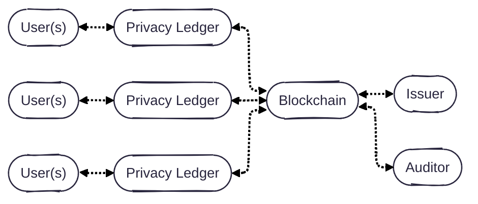
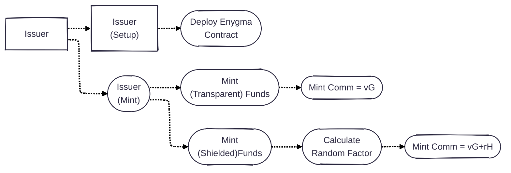
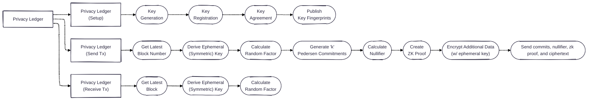

# Enygma Payments

## System Architecture

## Protocol Flows

### Issuer

### Privacy Ledger

First, each privacy ledger generates and registers two keypairs (view and spend) on the underlying blockchain. This blockchain effectively acts as a Public-Key Infrastructure (PKI) containing a registry of all public-keys of the registered privacy ledgers. Subsequently, each privacy ledger performs a post-quantum key agreement (i.e., ML-KEM) and establishes individual shared secrets with all the other privacy ledgers. At this point, privacy ledgers can start transacting privately with each other. The transaction protocol includes a hash-based private messaging tag component that allow recipients to detect privately whether or not a transaction is for them. Therefore, we also introduce a protocol to fetch (and decrypt) transactions.

### Blockchain

## Cryptographic Primitives

## Implementation Details
* **Client**: Golang
* **Circuits**: Gnark
* **Verifier**: Solidity

## Peer-Reviewed Publications
- [Rayls: A Novel Design for CBDCs](https://eprint.iacr.org/2025/1639), published at [The 6th Workshop on Coordination of Decentralized Finance (CoDecFin) 2025](https://fc25.ifca.ai/codecfin/)
- [Rayls II: Fast, Private, and Compliant CBDCs](https://eprint.iacr.org/2025/1638), published at [Financial Cryptography in Rome (FCiR) 2025](https://www.decifris.it/fcir25/)
