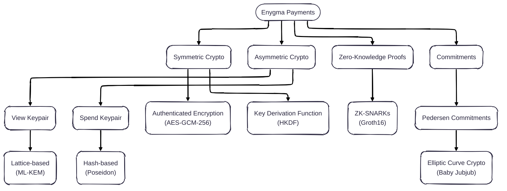

# Enygma Payments

## Sub-Protocols

## Cryptographic Primitives

## Implementation Details
* **Client**: Golang
* **Circuits**: Gnark
* **Verifier**: Solidity

## Peer-Reviewed Publications
- [IACR ePrint 2025/1639](https://eprint.iacr.org/2025/1639)
- [IACR ePrint 2025/1638](https://eprint.iacr.org/2025/1638)
