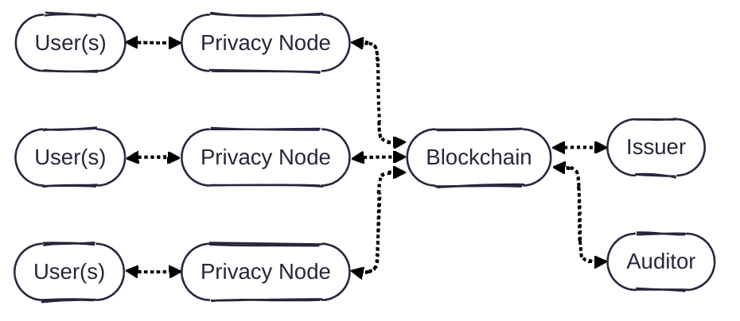
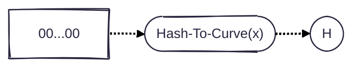
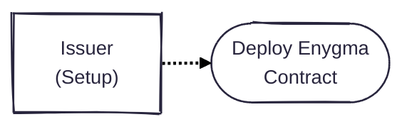
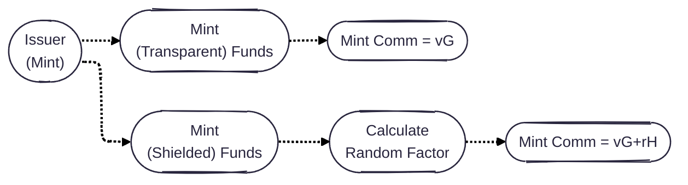
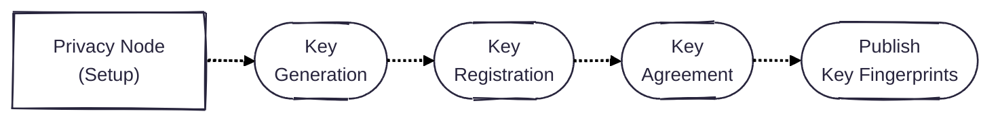
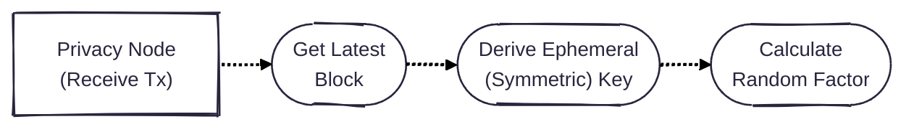
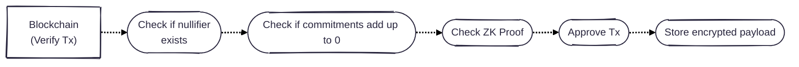
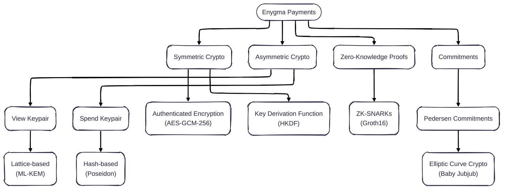

# Enygma Payments

## System Architecture
Our system is simple: **users** (e.g., a bank customers) are directly connected to **privacy nodes** (i.e., a high-performance single-node EVM blockchain). Each of the privacy nodes, is connected to a **private network hub**, which will effectively act as a bulletin board for all privacy nodes to leverage as a universal (encrypted) messaging layer and verification layer. **Issuer(s)** are owners of specific assets on the private network hub. Optionally, there is an **auditor** that oversees (some of) the transactions that take place in the network. 

## Protocol Flows

### Transparent Setup for Generator H

We use Pedersen commitments to mask the balances of the parties in the system and balances of the transactions. Such commitment relies on two generators: $$G$$ and $$H$$. We highlight, however, that knowing the relationship between these two generators is insecure as it breaks the binding property of the scheme. Concretely, if an entity knows the relationship between the generators $$G$$ and $$H = dG$$ (i.e., knows the value $$d$$), then such entity can open their commitments in any way they want. To avoid this, Enygma uses a [nothing-up-my-sleeve number](https://en.wikipedia.org/wiki/Nothing-up-my-sleeve_number) obtained by hashing a constant to the curve that is used in the system. This adds an additional layer of transparency. 

### Issuer

#### Issuer - Setup

#### Issuer - Mint

### Privacy Node

#### Privacy Node - Setup
First, each Privacy Node generates and registers two keypairs (view and spend) on the underlying blockchain. This blockchain effectively acts as a Public-Key Infrastructure (PKI) containing a registry of all public-keys of the registered Privacy Nodes. Subsequently, each Privacy Node performs a post-quantum key agreement (i.e., ML-KEM) and establishes individual shared secrets with all the other Privacy Nodes. At this point, Privacy Nodes can start transacting privately with each other. The transaction protocol includes a hash-based private messaging tag component that allow recipients to detect privately whether or not a transaction is for them. Therefore, we also introduce a protocol to fetch (and decrypt) transactions.

#### Privacy Node - Sending a TX

```mermaid
---
config:
  theme: redux
  layout: elk
  look: handDrawn
---
flowchart LR

    %% PL (Send)
    pl_send["Privacy Node<br>(Send Tx)"]
    getblock_send(["Get Latest<br>Block Number"])
    derivesendkey(["Derive Ephemeral<br>(Symmetric) Key"])
    calcR_send(["Calculate<br>Random Factor"])
    tx_commits(["Generate 'k'<br>Pedersen Commitments"])
    nullifier(["Calculate<br>Nullifier"])
    zk_proof(["Create<br>ZK Proof"])
    encrypt_ad(["Encrypt Additional Data<br>(w/ ephemeral key)"])
    send_tx(["Send commits, nullifier, zk proof, and ciphertext"])

    pl_send -.-> getblock_send -.-> derivesendkey -.-> calcR_send -.-> tx_commits -.-> nullifier -.-> zk_proof -.-> encrypt_ad -.-> send_tx

```

#### Privacy Node - Receiving a TX

### Blockchain
We now describe the flows associated with the underlying blockchain. In this case, we have just one: the verification of enygma transactions. 

#### Blockchain - Verify TX
The smart contract receives a set of commitments, a nullifier, a ZK proof, and an encrypted payload. The encrypted 

## Cryptographic Primitives

Note: In the future we want to update the ZK module to use a quantum-secure ZK scheme. This update will make the entire system quantum-secure.

## Implementation Details
* **Client**: Golang
* **Circuits**: Gnark
* **Verifier**: Solidity

## Peer-Reviewed Publications
- [Rayls: A Novel Design for CBDCs](https://eprint.iacr.org/2025/1639), published at [The 6th Workshop on Coordination of Decentralized Finance (CoDecFin) 2025](https://fc25.ifca.ai/codecfin/)
- [Rayls II: Fast, Private, and Compliant CBDCs](https://eprint.iacr.org/2025/1638), published at [Financial Cryptography in Rome (FCiR) 2025](https://www.decifris.it/fcir25/)
