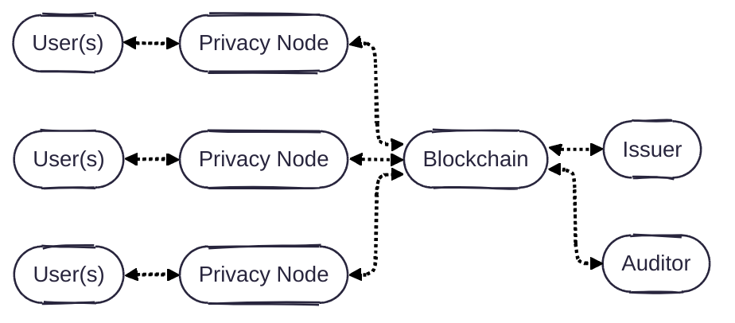
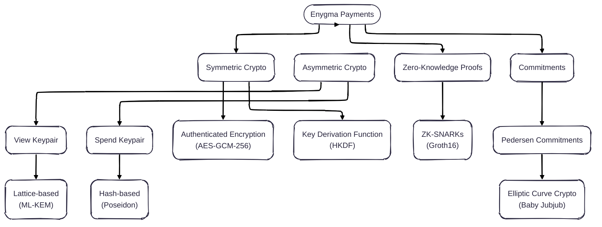

# Enygma Payments

## System Architecture
Our system is simple: **users** (e.g., a bank customers) are directly connected to **privacy nodes** (i.e., a high-performance single-node EVM blockchain). Each of the privacy nodes, is connected to a **private network hub**, which effectively acts as a bulletin board for all privacy nodes to leverage as a universal (encrypted) messaging layer and verification layer. **Issuer(s)** are owners of specific assets on the private network hub. Optionally, there is an **auditor** that oversees (some of) the transactions that take place in the network. The protocol flows involving each of these entities are further described [here](./protocol_flows.md). Alternatively, a more formal protocol description is documented [here](./protocol_description.md).

## Cryptographic Primitives

Note: We want to update the ZK module to use a quantum-secure ZK scheme. This update will make the entire system quantum-secure.

## Implementation Details
* **Client**: Golang
* **ZK Circuit(s)**: Gnark
* **Verifier**: Solidity

## Peer-Reviewed Publications
- [Rayls: A Novel Design for CBDCs](https://eprint.iacr.org/2025/1639), published at [The 6th Workshop on Coordination of Decentralized Finance (CoDecFin) 2025](https://fc25.ifca.ai/codecfin/)
- [Rayls II: Fast, Private, and Compliant CBDCs](https://eprint.iacr.org/2025/1638), published at [Financial Cryptography in Rome (FCiR) 2025](https://www.decifris.it/fcir25/)
