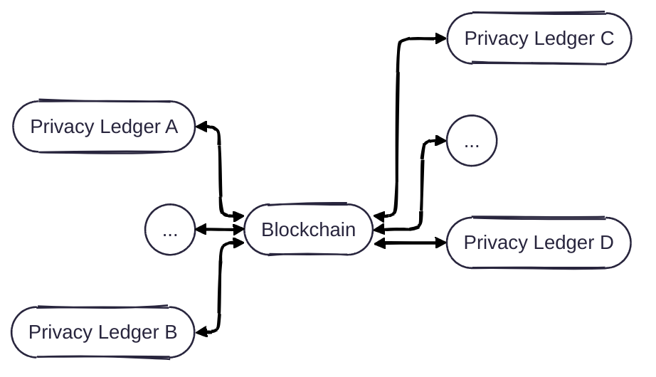
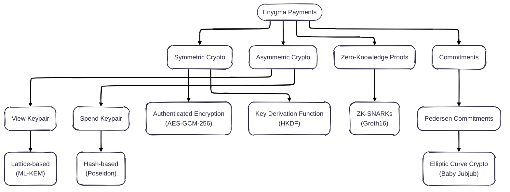

# Enygma Payments

## System Architecture

## Sub-Protocols

## Cryptographic Primitives

## Implementation Details
* **Client**: Golang
* **Circuits**: Gnark
* **Verifier**: Solidity

## Peer-Reviewed Publications
- [Rayls: A Novel Design for CBDCs](https://eprint.iacr.org/2025/1639), published at [The 6th Workshop on Coordination of Decentralized Finance (CoDecFin) 2025](https://fc25.ifca.ai/codecfin/)
- [Rayls II: Fast, Private, and Compliant CBDCs](https://eprint.iacr.org/2025/1638), published at [FCiR25 - Financial Cryptography in Rome 2025](https://www.decifris.it/fcir25/)
