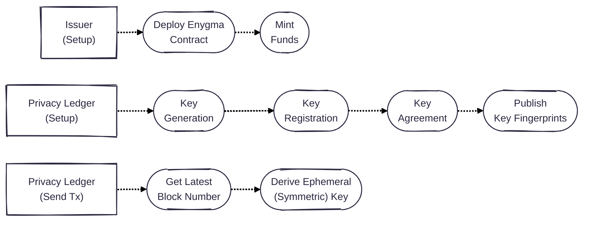

# Protocol Description

## Notation

* Balances are represented as Pedersen commitments:
  * $$Comm(v, r) = vG + rH$$

* Each privacy ledger has two keypairs. One for viewing transactions (ML-KEM), other for spending (hash-based). Both are quantum-secure: 
  * $$(sk_{A}^{view}, pk_{A}^{view})$$
  * $$(sk_{A}^{spend}, pk_{A}^{spend})$$

* Shared secret s is randomly generated and shared using a post-quantum key agreement (i.e., ML-KEM):
  * $$Encapsulate(pk', s')$$

* Random factors r are derived from hashing a shared secret and a block number:
  * $$r = Hash(s, n_{block})$$ 

## System Setup
All participants start with a balance with $$v=0$$ and $$r=0$$. Therefore, the Issuer creates a contract where the initial balance for all the participants is:

$$Comm(0, 0) = 0G + 0H$$

## Key Generation
* Privacy Ledger A generates an ML-KEM pair and obtains $$(sk_{A}^{view}, pk_{A}^{view})$$

* Privacy Ledger A generates a simple hash-based keypair and obtains $$(sk_{A}^{view}, pk_{A}^{view})$$.
  *  $$sk_{A}^{view} \longleftarrow \\\{{0, 1\\\}}^{256}$$
  *  $$pk_{A}^{view} = Hash(sk_{A}^{view})$$
 
The goal here is to have segregation of functionalities with each keypair. To spend, the user proves in zero-knowledge that they know $$sk^{spend}$$ corresponding to a $$pk^{spend}$$ in the anonymity set. We note that the hashing used in this step is ZK-friendly (i.e., Poseidon). On the other hand, the view key pair is used to generate a shared secret, which is then subsequently used 

## Key Agreement
One of the parties downloads the counterparty's ML-KEM public-key $$pk'$$, generates a pre-secret $$s'$$ and encapsulates it, thus obtaining $$Encapsulate(pk', s')$$. Sender also obtains $$id = Hash(s')$$ and publishes both $$< id, Encapsulate(pk', s')>$$ on the underlying blockchain. 

## Issuing Tokens
There are two ways of issuing tokens. The issuer can mint tokens in a transparent manner and everyone in the system can see the underlying amounts. Alternatively, the issuer can mint tokens that are shielded from the start. We describe both approaches below. 

### Transparent Issuance
Issuer creates a new Commitment with the random factor set to 0. Therefore: 

$$Comm(v, 0) = vG + 0H = vG$$

This allows anyone to be able to see how much money was minted in the system. 

### Private Issuance
Issuer acts as a system entity and establishes a shared secret with every participant in the network, and creates a new commitment with the random factor set accordingly. Concretely, $$r = Hash(s, n_{block})$$. This commitment gets added to the previous balance (of zero). Therefore, the initial balance after a private issuance is:

$$Comm(v, r) = vG + rH$$

This ensures only the issuer and the recipient know how much money was minted. We note, however, that it's still possible to have verifiability on the minting side, in the sense that every time there is a mint that the system knows a mint occcurred. 

## Auditing
There are multiple types of auditing supported by the protocol. Concretely, the auditor can have a 'universal view' and have the ability of seeing all the transactions that take place in the network. 

#### View Key Sharing
If there is an auditor that needs the complete view of the transactions in the network, then each privacy ledger shares their view key pair with the auditor upon the key registration step. To do so, each privacy ledger encrypts their view secret key (i.e., $$sk_{A}^{view}$$) and publishes it on the blockchain for the auditor to fetch. 

For example, privacy ledger A publishes:

$$ ctxt = Encapsulate(pk_{audit}^{view}, sk_{A}^{view})$$

#### Ephemeral Symmetric (View) Key Sharing
Our system also supports the opening of individual transctions without compromising the secrecy of previous/future transactions. Since the system uses symmetric key encryption with ephemeral (per block) keys, we have a mode of operation where the sender or recipient can simply disclose individual symmetric keys and open individual transctions. 

The symmetric key $$k$$ for block $$n$$ (i.e, $$k_{n}$$) is obtained the following way: 

$$k_{n} = HKDF(s, n_{block})$$

