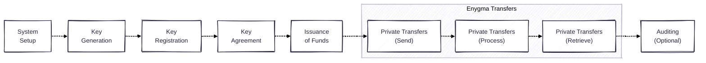
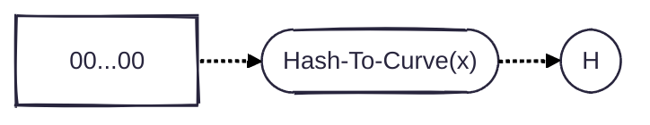
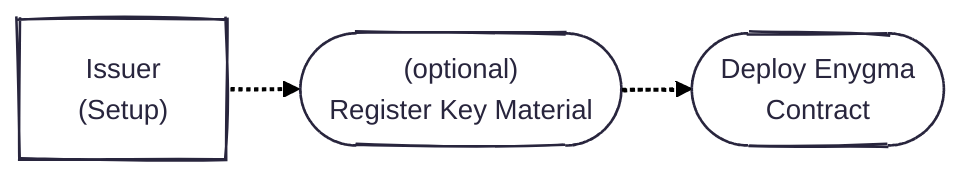
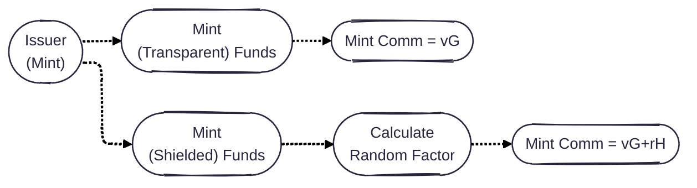
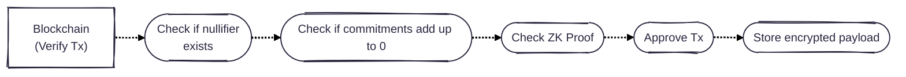
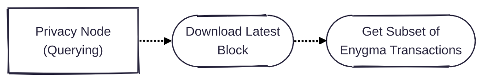
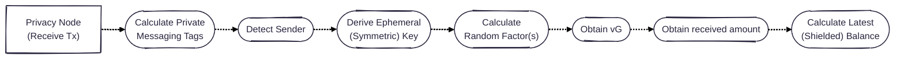
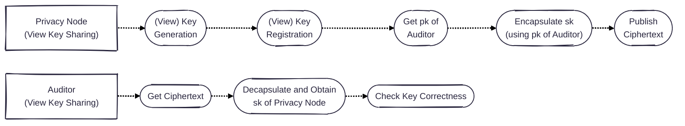
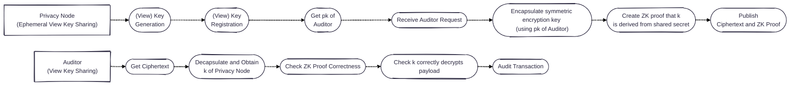

# Protocol Description

In this document, we describe the Enygma payments protocol, which is comprised of different sub-protocols. Concretely, we have an initial **System Setup** where the system parameters are defined. Subsequently, we have a **Key Generation** step where parties generate keypairs. A **Key Registration** step where parties register the public keys on the underlying blockchain, and a **Key Agreement** step where parties run a key agreement protocol to establish pairwise shared secrets. Once completed, parties can start transacting privately. This transfer stage has a **Send**, **Process**, and **Retrieve** step. Finally, if required, the system supports an **Auditing** step. 

## Notation

* G and H are generators of the used group (i.e., BN254).
* Hash(x) represents a cryptographically-secure (and ZK-friendly) hash of preimage 'x'.
* Hash-To-Curve(x) represents an algorithm for hashing an arbitrary string 'x' to a point on the elliptic curve.
* $$Comm(v, r)$$ is a (Pedersen) commitment to value $$v$$ with a random factor $$r$$.
* $$sk_{i}^{spend}$$ is the spend secret key for entity $$i$$.
* $$pk_{i}^{spend}$$ is the spend public key for entity $$i$$.
* $$sk_{i}^{view}$$ is the view secret key for entity $$i$$.
* $$pk_{i}^{view}$$ is the view public key for entity $$i$$.
* $$n_{block}$$ is the latest block number.
* $$k$$ is the anonymity set of the system.
* $$t_{i}$$ is the private messaging tag of index $$i$$, s.t.,  $$i \in \lbrace 1,\ldots,k \rbrace$$
* $$s_{i, j}$$ is the shared secret established between party $$i$$ and party $$j$$.
* $$\text{nullifier}$$ is the nullifier that is sent in each transaction to ensure entities are not able to double-spend.
* $$\pi$$ is the zero-knowledge proof that is appended to an Enygma transaction.
* $$K_{i, j}^{n}$$ is the symmetric encryption key used for encrypting payloads on block $$n$$ between participants $$i$$ and $$j$$.

## 1 - System Setup

### Transparent Setup for Generator H

We use Pedersen commitments to mask the balances of the parties in the system and balances of the transactions. Such commitment relies on two generators: $$G$$ and $$H$$. We highlight, however, that knowing the relationship between these two generators is insecure as it breaks the binding property of the scheme. Concretely, if an entity knows the relationship between the generators $$G$$ and $$H = dG$$ (i.e., knows the value $$d$$), then such entity can open their commitments in any way they want. To avoid this, Enygma uses a [nothing-up-my-sleeve number](https://en.wikipedia.org/wiki/Nothing-up-my-sleeve_number) obtained by hashing a constant to the curve that is used in the system. This adds an additional layer of transparency. 

### ZK Trusted Setup (Groth16)
Enygma relies on the Groth16 ZK scheme, which requires an initial trusted setup. Ideally, such a trusted setup is in the form of an MPC protocol where different participants contribute with random secrets, which must be destroyed after the ceremony to ensure that a single party does not have the ability to subvert the system (i.e., forge proofs). The output of this trusted setup is the Common Reference String (CRS) for the circuit. 

We envision this step to take place involving different Privacy Nodes in the system. We note that each Privacy Node represents a regulated financial institution. Therefore, it is reasonable to assume that at least one of the institutions will abide by the protocol and preserve the security of the trusted setup stage. 

### Issuer Setup
The setup for the issuer is straightforward as it consists simply of deploying the corresponding Enygma smart contract. Optionally, to support certain private functionalities, the issuer may need to register some key material. 

### Balance Setup
All participants start with a balance with $$v=0$$ and $$r=0$$. 

Therefore, the Issuer creates a contract where the initial balance for all the participants is:

$$Comm(0, 0) = 0G + 0H$$

## 2 - Key Generation
Each privacy node generates two keypairs: one to spend funds, and one to 'view' transactions. Concretely: 

* Privacy node A generates an [ML-KEM](https://nvlpubs.nist.gov/nistpubs/FIPS/NIST.FIPS.203.pdf) (view) keypair and obtains $$(sk_{A}^{view}, pk_{A}^{view})$$

* Privacy node A generates a simple hash-based (spend) keypair and obtains $$(sk_{A}^{spend}, pk_{A}^{spend})$$.
  *  $$sk_{A}^{spend} \longleftarrow \\\{{0, 1\\\}}^{256}$$
  *  $$pk_{A}^{spend} = Hash(sk_{A}^{spend})$$
 
The goal here is to have segregation of functionalities with each keypair. 

To spend, the user proves in zero-knowledge that they know a secret key $$sk^{spend}$$ corresponding to one public key $$pk^{spend}$$ in an anonymity set of size $$k$$. We note that the hashing used in this step is ZK-friendly (i.e., Poseidon). On the other hand, the view key pair is used to generate shared secrets with other participants, which are then subsequently used to derive random factors for every block and ephemeral symmetric encryption keys for symmetric encryption. 

## 3 - Key Registration
Privacy node registers both the view and spend public keys on the underlying blockchain. 

For example, if privacy node A registers, the tuple below should be the output of the registration step: 

$$(id_{A}, pk_{A}^{view}, pk_{A}^{spend})$$

## 4 - Key Agreement
We run the following ML-KEM protocol adapted to use the underlying blockchain as a global PKI for the network and a bulletin board for universal ciphertext publishing. 

* The sender $$j$$ downloads the counterparty's $$i$$ ML-KEM public key $$pk_{i}^{view}$$ and runs $$\text{ML-KEM.Encapsulate}(pk_{i}^{view})$$ and obtains a ciphertext $$ctxt_{i,j}$$ and a shared secret $$s_{i,j}$$. 

* The sender computes $$id = Hash(s_{i,j})$$ and publishes $$⟨i, j, id, ctxt_{i, j}⟩$$ on the underlying blockchain. This allows the recipient to know that they have a new message for them and who is publishing it.

* The counterparty $$i$$ watches the chain, downloads $$⟨i, j, id, ctxt_{i, j}⟩$$, runs $$\text{MLKEM.Decaps}(sk_{i}^{view}, ctxt_{i, j})$$, obtains a shared secret $$s'_{i,j}$$, and computes $$id' = Hash(s')$$. If $$id' = id$$, party $$i$$ publishes a sign-off message and is ready to receive private transactions from the sender.

## 5 - Issuing Tokens
There are two ways of issuing tokens. The issuer can either mint a commitment with the random factor set to zero which publicly discloses the minted amount or, alternatively, act as a participant in the network and mint a shielded balance in the form of Pedersen commitment where the random factor is derived from the shared secret between the issuer and the receiver of funds. This specific mechanism to generate the random factor ensures that the issuer can mint a specific amount and the recipient can detect the minted amount. 

### Transparent Issuance
Issuer creates a new commitment with the random factor set to 0. Therefore: 

$$Comm(v, 0) = vG + 0H = vG$$

This allows anyone to be able to see how much money was minted in the system. 

### Private Issuance
Issuer acts as a system entity and establishes a shared secret with every participant in the network, and creates a new commitment with the random factor set accordingly. Concretely, $$r = Hash(s, n_{block})$$. This commitment gets added to the previous balance (of zero). Therefore, the initial balance after a private issuance is:

$$Comm(v, r) = vG + rH$$

This ensures only the issuer and the recipient know how much money was minted. We highlight that the issuer knows both $$v$$ and $$r$$ for every private mint. This does not degrade confidentiality beyond the fact that the issuer is the one minting and thus intentionally knows the amount and beneficiary. We note that it's also possible to have verifiability on the minting side, in the sense that every time there is a mint that the system knows a mint occcurred. 

On a final note, the issuer can transparently publish the total circulating supply along with a ZK proof that shows that the addition of all Pedersen commitment balances on-chain results in that published balance. This is an alternative to provide further transparency in a system where the issuer does not want to disclose individual mint amounts. 

## 6 - Private Transfers

### Transaction Structure
We assume an anonymity set of size $$k$$, from which the sender is in index $$j$$. The exact transaction payload consists of a set of $$k$$ (Pedersen) commitments, a nullifier, a zero-knowledge proof $$\pi$$, a set of $$k$$ private messaging tags, and a set of $$k$$ ciphertexts. 

Since we publish $$k$$ commitments per transaction, we effectively support the sender to pay up to $$k-1$$ banks (all $$k$$ members in the anonymity set except themselves). This allows for batching of payments. Additionally, we append a ciphertext to each of these commitments, which can contain additional information about each of the payments. Therefore, we can encode additional information that allows for double batching. 

**For example, a single transaction from a financial institution can pay multiple clients in each of the other banks. This is a payment with double aggregation.**

| $$Commit_1$$ | $$\ldots$$ | $$Commit_k$$ | $$\text{nullifier}$$ | $$t_1$$ | $$\ldots$$ | $$t_k$$ | $$\pi$$| $$ctxt_1$$ | $$\ldots$$ | $$ctxt_k$$ |
|--------------|------------|--------------|----------------------|---------|------------|---------|---------|------------|------------|-----------|

#### Commitments
We use Pedersen commitments as shielded balances. Represented as follows: 

$$
\forall i \in \lbrace1,\ldots,k\rbrace:\quad
Commit_i = v_{i}G + r_{i}H
$$

The **amount** to be received by each entity $$v_{i}$$ is simply the number of monetary units to be transferred to that entity. The **random factor** of each recipient is obtained by hashing the shared secret between the sender $$j$$ and the recipient $$i$$: 

$$
\forall i \in \lbrace1,\dots,k\rbrace,\ i \neq j:\quad r_{i} = Hash(s_{i, j}, n_{block})
$$

The commitment of the sender contains the amount $$v_{j}$$ and random factor $$r_{j}$$. We have the following constraints

**The amount** in the commitment of the sender is the negative (since it's a debit) of all the amount that is being sent. This ensures that no new money enters the system. 

$$
v_j = - \sum_{i=1}^{k} v_i \text{ , } \text{where } i \neq j
$$

**The random factor** of the commitment of the sender is the negative of the sum of all the other random factors of the recipients. This ensures that the addition of all the $$k$$ commitments ensures that the amounts and random factors cancel out and it's possible to verify at a contract level that all the commitments in the transaction add up to $$0$$. 

$$
r_j = - \sum_{i=1}^{k} r_i \text{ , } \text{where } i \neq j
$$

**Our system ensures the following balance conservation invariant:**

Amounts sent in a transaction must add up to zero. 

$$
\sum_{i=1}^{i=k} v_i = 0
$$

Random factors for a set of commitments must add up to zero. 

$$
\sum_{i=1}^{i=k} r_i = 0
$$

#### Nullifier

The nullifier is calculated by simple hashing the (spend) secret key of the sender $$j$$ and the latest block number $$n_{block}$$. 

$$\text{nullifier} = Hash(sk_{j}^{spend}, n_{block})$$

#### Private Messaging Tags
The private messaging tags are obtained by hashing the shared secret $$s$$ between both parties. For the slot of the sender, one must use a different value as a sender does not have a shared secret established with themselves. A poor choice of this value can also break the privacy of the sender as it could potentially allow a network observer to infer additional information about that specific tag. Instead, we hash the random value $$r$$ of the previous balance commitment. We note that a sender has a shielded balance on-chain, which they're always able to open (as they know the amount they have and are always able to obtain the corresponding random factor). We choose this random value because it is a secret value, known only to the sender, and it is already an input to the ZK circuit we use in our system. 

$$
\forall i \in \lbrace 1,\ldots,k \rbrace:\quad
t_i =
\begin{cases}
Hash(r_j^{prev},n_{block}) & \text{if } i = j,\\
Hash(s_{i, j},n_{block}) & \text{if } i \neq j.
\end{cases}
$$

#### Zero-Knowledge Proof
The privacy node creates a ZK proof $$\pi$$ that proves the following: 

* I know the secret key of one of the items in this anonymity set of $$k$$ public keys;
* I know the amount and random factor of the commitment that contains my balance in this set of $$k$$ commitments;
* The nullifier is well-formed and uses my secret key and the latest block number;
* The private messaging tags are well-formed. Therefore, they use the shared secret I have obtained previously with each of the $$k-1$$ participants and the latest block number or the random factor that opens a commitment from the anonymity set for the index of the sender.

#### Ciphertexts 
A transaction payload includes a set of $$k$$ ciphertexts (encrypted using AES-GCM-256). These ciphertexts should contain additional information for the recipient to be able to quickly open the transaction details (i.e., the Pedersen commitments) and potentially get more information about the specific recipient (e.g., user Bob, who is a client of that specific receiving bank). **These ciphertexts are encrypted with an ephemeral symmetric key that is rotated in every new block**. This key rotation is useful and by design to allow specific auditors to potentially request for individual transactions without compromising the confidentiality of past/future ciphertexts. 

The symmetric key $$K$$ for block $$n$$ between participants $$i$$ and $$j$$ is obtained the following way: 

$$K_{i, j}^{n} = HKDF(s_{i,j}, n_{block})$$

The corresponding ciphertext is then calculated by encrypting (using AES-GCM-256) a message $$m$$ that contains additional transaction data. 

$$ctxt_{i} = Enc(K_{i, j}^{n}, m)$$

We note that the correctness of these ciphertext is not part of the ZK proof and these values can indeed be maliciously formed. This is by design to keep the circuit cheap. The commitment, however, will always be of a valid amount and will correspond to a debit. Therefore, performing this attack will always cost funds and will allow the recipient to prove that the sender is indeed malicious, by simply showing that the received ciphertext does not open under the corresponding symmetric key for that block. In other words, the only effect of a malformed ciphertext is that the sender burns funds and produces a publicly verifiable incriminating record.

We believe this trade-off is ideal for multiple reasons. Concretely, the trust model with financial institutions is different as these are regulated institutions. In this setting, it is very easy to prove malfeasance. Finally, this approach allows the design to have a very cheap overall prover cost, which allows institutions to make very fast (aggregated) payments. 

### Sending a Transaction
To send a transaction, the privacy node needs to be in sync with the latest block on the blockchain. The purpose for this is twofold: first, the privacy node needs to create a nullifier and random factors that depend on that specific last block; and second, the privacy node needs to know what is the latest shielded balance it has in order to be able to spend funds. Therefore, the first step to send a transaction is to obtain the latest block. From the latest block number, the privacy node derives the ephemeral symmetric key used to encrypt additional/associated data of the transaction. The privacy node then calculates the corresponding random factors to be used in the transaction, and the nullifier for this block. The privacy node also calculates a set of $$k$$ (i.e., anonymity set) Pedersen commitments using the previously obtained random factors and the amount to be sent to each party along with a nullifier that proves that the sender is submitting its only allowed transaction in this block, without revealing details about who they are. Once these values are calculated, 

```mermaid
---
config:
  theme: redux
  layout: elk
  look: handDrawn
---
flowchart LR

    %% PL (Send)
    pl_send["Privacy Node<br>(Send Tx)"]
    getblock_send(["Get Latest<br>Block"])
    derivesendkey(["Derive Ephemeral<br>(Symmetric) Key"])
    calc_r(["Calculate<br>Random Factor"])
    calc_tags(["Calculate Private<br>Messaging Tags"])
    tx_commits(["Generate 'k'<br>Pedersen Commitments"])
    nullifier(["Calculate<br>Nullifier"])
    zk_proof(["Create<br>ZK Proof"])
    encrypt_ad(["Encrypt Additional Data<br>(w/ ephemeral key)"])
    send_tx(["Send commits, nullifier, zk proof, and ciphertext"])

    pl_send -.-> getblock_send -.-> derivesendkey -.-> calc_r -.-> calc_tags -.-> tx_commits -.-> nullifier -.-> zk_proof -.-> encrypt_ad -.-> send_tx

```

#### Verifying a TX (Blockchain)
The smart contract receives a set of commitments, a nullifier, a ZK proof, and an encrypted payload. 

We note that the encrypted payload is not checked by the smart contract and can be maliciously formed as its correctness is not included in the ZK proof. We note that this attack forces the sender to send funds, which the recipient is able to open since the Pedersen commitment is well-formed. The same recipient is then able to prove that the sender maliciously formed the ciphertext and eventually  have the sender face repercussions for a purposeful malicious action. The ciphertext is not included in the ZK proof because proving the correctness of an AES-GCM encryption is too expensive to perform for the execution of real-time transactions. 

#### Querying For New Transactions
We assume each privacy node runs a full node of the underlying blockchain. Therefore, each node has the ability (and responsibility) to download the latest block and performs a lookup (locally) for transactions that include the privacy node in the anonymity set (i.e., transactions that may be for them). This is effectively the trivial [Private Information Retrieval](https://en.wikipedia.org/wiki/Private_information_retrieval) protocol, where a client downloads the entire dataset and performs the lookup locally. We leverage the full node role and leverage it to provide a private querying functionality to ensure privacy nodes do not reveal which transactions they are querying. 

### Retrieving a Transaction
Privacy node derives the private messaging tags, symmetric keys, and random factors for all the entities in the anonymity set(s) of all the transactions in such a block. The privacy node is then going to brute-force try the symmetric decryption of each transaction. This work is paralellizable and extremely fast as it is simply performing $$k-1$$ hash operations for each received transaction. Once the sender is detected, the recipient can perform an AES-GCM decryption and obtain more information about the transfer details in the corresponding plaintext. In the event that the sender was malicious, the recipient now knows the sender associated with this transaction was malicious and is able to prove that the symmetric key for that specific block does not result in a successful AES-GCM decryption. 

In order to open the balance from the transaction. Since the Pedersen commitments are well-formed (enforced by the ZK proof), the recipient, who knows the corresponding random factor $$r$$, can remove the randomness component and obtain $$vG$$.

Concrete deployments will impose limits on transfer amounts (i.e., the value of $$v$$), which ensures that the discrete-log-based recovery of $$v$$ from $$vG$$ is practical enough to be feasible to conduct in a catastrophic scenario. To obtain the received amount $$v$$ from $$vG$$, we provide three options:

* brute-force the value of $$v$$ (time-consuming but feasible since this is a monetary amount and should not be a very high amount)
* have a precomputed table containing all the possible reasonable values for $$vG$$ for all nodes in the network
* use an efficient algorithm to compute the discrete log of this element (e.g., [baby-step giant-step](https://en.wikipedia.org/wiki/Baby-step_giant-step))

#### Simple Example
Let us assume there are two Enygma transactions (with an anonymity set $$k = 3$$) in a specific block. One transaction includes Alice, Bob, and Charlie. A second transaction includes Alice, Bob, and Dave. This is the anonymity set for each of the transactions. Traditionally, $$k=6$$, but for simplicity, we use $$k = 3$$. Let us also assume Alice is the person checking if there are funds for them. In this case, Alice is going to obtain the private messaging tags, symmetric encryption keys, and random factors associated with Bob, Charlie, and Dave for that specific block. After obtaining such tag(s), Alice checks (i.e., via brute-force) who is the sender of the transaction by comparing the private messaging tag for each of the entities in the anonymity set with the one included in the transaction. 

Let us assume Bob is the sender of the first transaction and Charlie of the second transaction. Alice uses the corresponding symmetric key with Bob to decrypt the additional data appended to the first transaction and the same for the second transaction using the key with Charlie. We note that this additional data should include the amount sent to make the receiving process simpler. However, in the event this data is not included, Alice obtains the random factor $$r = Hash(s_{A, B}, n_{block})$$ and is able to remove the random component of the received Pedersen commitment and obtain the remainder $$vG$$. Alice then obtains the corresponding value $$v$$ and is able to calculate the received amount and can now open their balance and spend the funds in subsequent blocks. 

If $$v = 0$$, then Alice was part of the anonymity set and has not received any funds. We note that it may be the case that no entity in the anonymity set has received funds and it is a dummy transaction (i.e., sending $$0$$ to all participants to add additional noise to the system). 

## 7 - Auditing
There are multiple types of auditing supported by the protocol. Concretely, the auditor can have a 'universal view' and have the ability of seeing all the transactions that take place in the network. 

#### Long-term (View) Key Sharing
If there is an auditor that needs the complete view of the transactions in the network, then each privacy node shares their view key pair with the auditor upon the key registration step. To do so, each privacy node encrypts their view secret key (i.e., $$sk_{A}^{view}$$) and publishes it on the blockchain for the auditor to fetch. 

For example, privacy node B does the following: 

* Downloads the ML-KEM public key of the auditor $$pk_{audit}^{view}$$ and runs $$\text{ML-KEM.Encapsulate}(pk_{audit}^{view})$$ and obtains a ciphertext $$ctxt_{audit,B}$$ and a pre-secret $$s_{audit,B}$$. 

* Publishes $$⟨"audit", B, ctxt_{audit, B}⟩$$ on the underlying blockchain. This allows the auditor to know that they have a new ciphertext for them and who is publishing it.

* The auditor watches the chain, downloads the payload, runs MLKEM.Decaps$$(sk_{audit}^{view}, ctxt_{audit, B})$$, obtains the pre-secret $$s'_{audit,B}$$. Auditor is now ready to start auditing upcoming transactions involving B. 

#### Ephemeral Symmetric (View) Key Sharing
Our system also supports the opening of individual transctions without compromising the secrecy of previous/future transactions. Since the system uses symmetric key encryption with ephemeral (per block) keys, we have a mode of operation where the sender or recipient can simply disclose individual symmetric keys and open individual transctions. 

#### Universal Auditing
Besides the auditor, we highlight that any entity in the system can always monitor the following parameters just from looking at the underlying blockchain: 

* Entity can check the ZK proof and attest that the set of commitments are well-formed and add up to 0.
* Entity can check how many mints/burns exist in the network.

Additionally, depending on the choice of random factors and the issuance process, it may be possible for any entity to check the total supply of the asset at all times. 

## Additional Remarks

### Memory Complexity

| Component        | Complexity                                             | Additional Remarks                                                     |
|------------------|--------------------------------------------------------|------------------------------------------------------------------------|
| Key Registration |$$O(N ( \|pk^{view}\| + \|pk^{spend}\| ))$$             | Each privacy registers a key on the underlying blockchain.             |
| Key Agreement    |$$O(N + (N \times \|ok\|) )$$                           | Each privacy node establishes a key with all other privacy nodes.      |
| Tx Size          |$$O(k (\|C\| + \|t\| + \|ctxt\|) + \|\pi \| + \|nf\|)$$ | $$k$$ commitments, tags, ciphertexts, a zk proof, and a nullifier.     |
| Block Size       |$$O(N \times \|tx\|)$$                                  | Each bank can submit **at most** one tx per block.                     |

### Computational Complexity

| Component     | Complexity                                             | Additional Remarks                                                     |
|---------------|--------------------------------------------------------|------------------------------------------------------------------------|
| Key Agreement | $$O(N - 1)$$                                           | Each privacy node establishes a key with all the other privacy nodes.  |

