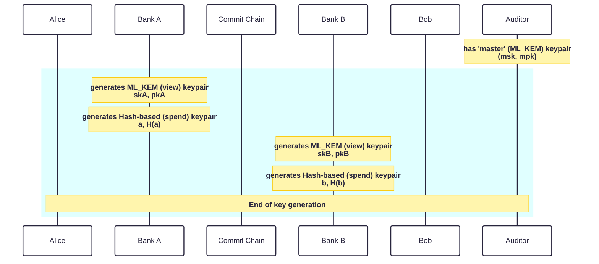
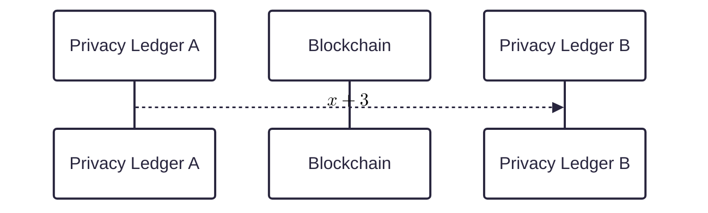

# Enygma Protocol Diagrams

## Key Registration

```mermaid
---
config:
  theme: redux
  look: handDrawn
---
sequenceDiagram
      participant A as Alice
      participant PLA as Bank A
      participant CC as Commit Chain
      participant PLB as Bank B
      participant B as Bob
      participant AA as Auditor

note over AA: has 'master' (ML_KEM) keypair<br>(msk, mpk)

  %%% KEY GENERATION PROTOCOL
  rect rgb(224, 255, 255)

    note over PLA: generates ML_KEM (view) keypair<br> skA, pkA
    note over PLA: generates Hash-based (spend) keypair<br>a, H(a)
    
    note over PLB: generates ML_KEM (view) keypair<br> skB, pkB
    note over PLB: generates Hash-based (spend) keypair<br>b, H(b)
    
    note over A, AA: End of key generation

  end


```

## Key Agreement

```mermaid
 ---
config:
  theme: redux
  look: handDrawn
---
  sequenceDiagram
      participant pla as Privacy Ledger A
      participant b as Blockchain
      participant plb as Privacy Ledger B

      pla -->> plb: $$x + 3$$

```
