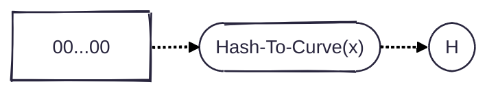
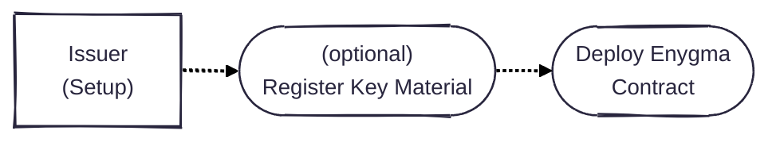
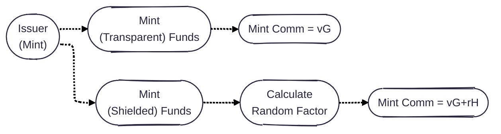
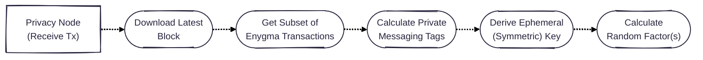
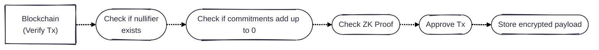
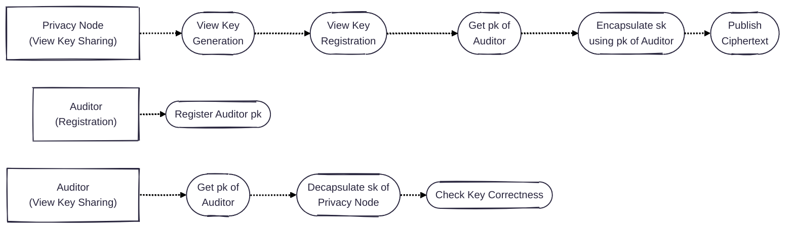

## Protocol Flows

### System Setup

#### Transparent Setup for Generator H

We use Pedersen commitments to mask the balances of the parties in the system and balances of the transactions. Such commitment relies on two generators: $$G$$ and $$H$$. We highlight, however, that knowing the relationship between these two generators is insecure as it breaks the binding property of the scheme. Concretely, if an entity knows the relationship between the generators $$G$$ and $$H = dG$$ (i.e., knows the value $$d$$), then such entity can open their commitments in any way they want. To avoid this, Enygma uses a [nothing-up-my-sleeve number](https://en.wikipedia.org/wiki/Nothing-up-my-sleeve_number) obtained by hashing a constant to the curve that is used in the system. This adds an additional layer of transparency. 

#### ZK Trusted Setup (Groth16)
Enygma relies on the Groth16 ZK scheme, which requires an initial trusted setup. Ideally, such a trusted setup is in the form of an MPC protocol where different participants contribute with random secrets, which must be destroyed after the ceremony to ensure that a single party does not have the ability to subvert the system (i.e., forge proofs). The output of this trusted setup is the Common Reference String (CRS) for the circuit. 

We envision this step to take place involving different Privacy Nodes in the system. We note that each Privacy Node represents a regulated financial institution. Therefore, it is reasonable to assume that at least one of the institutions will abide by the protocol and preserve the security of the trusted setup stage. 

### Issuer

#### Issuer - Setup
The setup for the issuer is straightforward as it consists simply of deploying the corresponding Enygma smart contract. Optionally, to support certain private functionalities, the issuer may need to register some key material. 

#### Issuer - Mint

There are two minting flows for the issuer is able to mint funds on the underlying smart contract. The issuer can either mint a commitment with the random factor set to zero which publicly discloses the minted amount or, alternatively, act as a participant in the network and mint a shielded balance in the form of Pedersen commitment where the random factor is derived from the shared secret between the issuer and the receiver of funds. 

### Privacy Node

#### Privacy Node - Setup
First, each Privacy Node generates and registers two keypairs (view and spend) on the underlying blockchain. This blockchain effectively acts as a Public-Key Infrastructure (PKI) containing a registry of all public-keys of the registered Privacy Nodes. Subsequently, each Privacy Node performs a post-quantum key agreement (i.e., ML-KEM) and establishes individual shared secrets with all the other Privacy Nodes. At this point, Privacy Nodes can start transacting privately with each other. The transaction protocol includes a hash-based private messaging tag component that allow recipients to detect privately whether or not a transaction is for them. Therefore, we also introduce a protocol to fetch (and decrypt) transactions.

#### Privacy Node - Sending a TX
To send a transaction, the privacy node needs to be in sync with the latest block on the blockchain. The purpose for this is twofold: first, the privacy node needs to create a nullifier and random factors for that specific block; and second, the privacy node needs to know what is the latest shielded balance it has in order to be able to spend it. Therefore, the first step to send a transaction is to obtain the latest block. From the latest block number, the privacy node can derive the ephemeral symmetric key used to encrypt additional/associated data in this block, can calculate the corresponding random factors to be used in the transaction, and the nullifier for this block. The privacy node calculates a set of $$k$$ (i.e., anonymity set) Pedersen commitments using the corresponding random factors and the amount to be sent to each party. 

```mermaid
---
config:
  theme: redux
  layout: elk
  look: handDrawn
---
flowchart LR

    %% PL (Send)
    pl_send["Privacy Node<br>(Send Tx)"]
    getblock_send(["Get Latest<br>Block"])
    derivesendkey(["Derive Ephemeral<br>(Symmetric) Key"])
    calc_r(["Calculate<br>Random Factor"])
    calc_tags(["Calculate Private<br>Messaging Tags"])
    tx_commits(["Generate 'k'<br>Pedersen Commitments"])
    nullifier(["Calculate<br>Nullifier"])
    zk_proof(["Create<br>ZK Proof"])
    encrypt_ad(["Encrypt Additional Data<br>(w/ ephemeral key)"])
    send_tx(["Send commits, nullifier, zk proof, and ciphertext"])

    pl_send -.-> getblock_send -.-> derivesendkey -.-> calc_r -.-> calc_tags -.-> tx_commits -.-> nullifier -.-> zk_proof -.-> encrypt_ad -.-> send_tx

```

#### Privacy Node - Receiving a TX

### Blockchain
We now describe the flows associated with the underlying blockchain. In this case, we have just one: the verification of enygma transactions. 

#### Blockchain - Verify TX
The smart contract receives a set of commitments, a nullifier, a ZK proof, and an encrypted payload. 

We note that the encrypted payload is not checked by the smart contract and can be maliciously formed as its correctness is not included in the ZK proof. We note that this attack forces the sender to send funds, which the recipient is able to open since the Pedersen commitment is well-formed. The same recipient is then able to prove that the sender maliciously formed the ciphertext and eventually  have the sender face repercussions for a purposeful malicious action. The ciphertext is not included in the ZK proof because proving the correctness of an AES-GCM encryption is too expensive to perform for the execution of real-time transactions. 

#### Auditing - View Key Sharing
TBD

